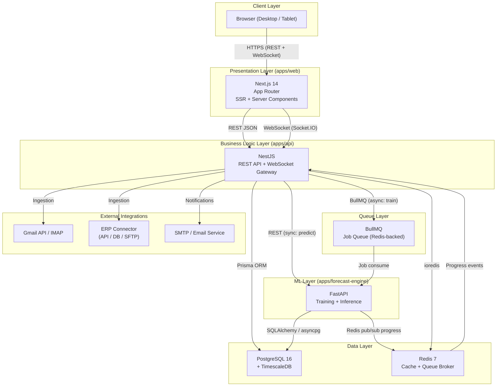

# 1. Architecture Overview

## 1.1 High-Level System Diagram



## 1.2 Service Communication Patterns

| Channel | Protocol | Direction | Purpose | Latency Target |
|---------|----------|-----------|---------|---------------|
| Frontend <-> Backend | REST (JSON over HTTPS) | Bidirectional | CRUD operations, queries, mutations | < 200ms (p95) |
| Frontend <-> Backend | WebSocket (Socket.IO) | Server-push | Real-time job progress, alerts | < 100ms |
| Backend -> FastAPI | REST (HTTP/JSON) | Sync | Prediction requests (inference) | < 5s (NFR-001) |
| Backend -> FastAPI | BullMQ (Redis) | Async | Training jobs (minutes to hours) | N/A (async) |
| FastAPI -> Backend | Redis pub/sub | Events | Training progress updates | < 100ms |
| Backend -> PostgreSQL | Prisma (TCP) | Bidirectional | All data persistence | < 50ms (p95) |
| FastAPI -> PostgreSQL | SQLAlchemy (TCP) | Bidirectional | Time series reads, result writes | < 100ms (p95) |

## 1.3 Deployment Topology

**Development (Docker Compose):**

```
docker-compose.yml
  |-- postgres (timescale/timescaledb:latest-pg16) .... port 5432
  |-- redis (redis:7-alpine) .......................... port 6379
  |-- api (NestJS) .................................... port 3001
  |-- web (Next.js) ................................... port 3000
  |-- forecast-engine (FastAPI) ....................... port 8000
```

**Production (AWS EKS -- Phase 5):**

```
AWS EKS Cluster
  |-- Namespace: forecasting-mrp
  |   |-- Deployment: web (Next.js) .................. 2-4 replicas, ALB ingress
  |   |-- Deployment: api (NestJS) ................... 2-4 replicas, internal LB
  |   |-- Deployment: forecast-engine (FastAPI) ...... 1-2 replicas (CPU inference)
  |   |-- Deployment: forecast-trainer (FastAPI) ..... 0-1 replicas (GPU Spot Instance)
  |   |-- StatefulSet: postgres ....................... RDS PostgreSQL 16 (managed)
  |   |-- Deployment: redis .......................... ElastiCache Redis (managed)
  |-- Namespace: monitoring
  |   |-- Prometheus + Grafana
  |   |-- CloudWatch integration
```

---
