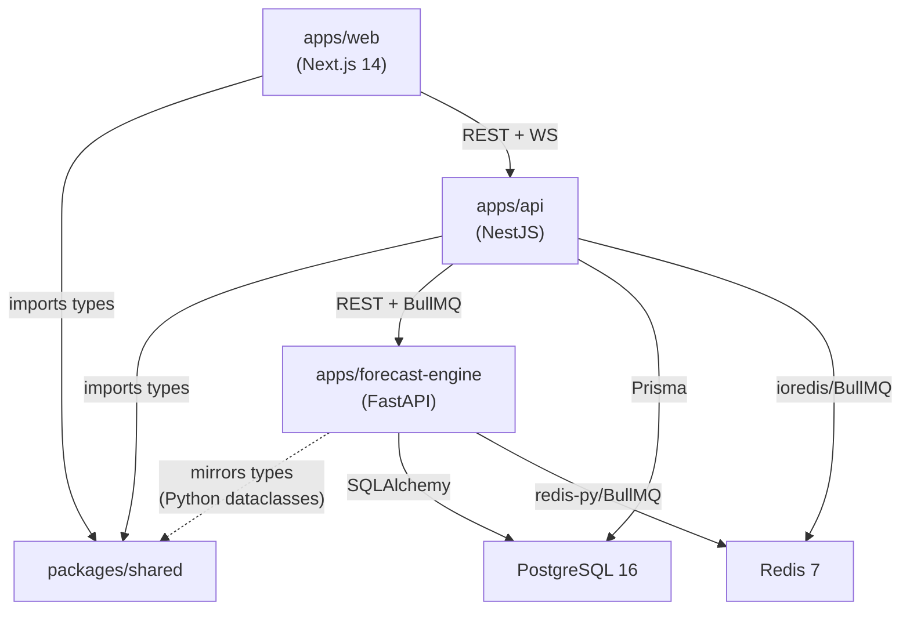

# 2. Monorepo Structure

## 2.1 Turborepo Configuration Rationale

The monorepo uses **Turborepo** to orchestrate builds across three distinct runtimes (TypeScript/Node.js, TypeScript/Node.js, and Python) while sharing types and configurations.

**Why Turborepo:**
- Task-based build orchestration with dependency graph awareness (`dependsOn: ["^build"]`)
- Remote caching support for CI/CD (speeds up builds by 40-60%)
- Parallel execution of independent tasks across workspaces
- Single repository for coordinated deployments and shared type definitions
- Simplified PR reviews: one PR can contain frontend + backend + types changes

## 2.2 Directory Structure

```
forecasting-mrp/
|-- turbo.json                          # Build pipeline configuration
|-- package.json                        # Root workspace (pnpm)
|-- pnpm-workspace.yaml                 # Workspace definition
|-- docker-compose.yml                  # Dev environment services
|-- .env.example                        # Environment variable template
|-- .github/
|   |-- workflows/
|   |   |-- ci.yml                      # PR pipeline: lint + typecheck + test + build
|   |   |-- deploy.yml                  # Main: build + deploy
|   |   |-- forecast-engine.yml         # Python-specific CI (pytest, mypy, ruff)
|
|-- apps/
|   |-- web/                            # Next.js 14 (App Router) -- Frontend
|   |   |-- src/
|   |   |   |-- app/                    # App Router pages and layouts
|   |   |   |-- components/             # Shared UI components
|   |   |   |-- lib/                    # Utilities, API client, hooks
|   |   |   |-- styles/                 # Global styles, Tailwind config
|   |   |-- next.config.js
|   |   |-- tailwind.config.ts
|   |   |-- tsconfig.json
|   |   |-- package.json
|   |
|   |-- api/                            # NestJS -- Backend API
|   |   |-- src/
|   |   |   |-- modules/                # Feature modules (one per domain)
|   |   |   |-- common/                 # Shared: filters, interceptors, DTOs
|   |   |   |-- config/                 # Configuration module
|   |   |   |-- prisma/                 # Prisma service, migrations
|   |   |   |-- main.ts                 # Bootstrap
|   |   |   |-- app.module.ts           # Root module
|   |   |-- prisma/
|   |   |   |-- schema.prisma           # Database schema
|   |   |   |-- migrations/             # Prisma migrations
|   |   |   |-- seed.ts                 # Synthetic seed data (FR-005)
|   |   |-- test/                       # Integration tests
|   |   |-- tsconfig.json
|   |   |-- package.json
|   |
|   |-- forecast-engine/                # FastAPI -- ML/Forecasting Service
|   |   |-- src/
|   |   |   |-- api/                    # FastAPI routes (train, predict, health)
|   |   |   |-- models/                 # ML model implementations
|   |   |   |-- pipeline/               # Execution pipeline steps
|   |   |   |-- features/               # Feature engineering
|   |   |   |-- backtesting/            # Backtesting framework
|   |   |   |-- workers/                # BullMQ job consumers
|   |   |   |-- db/                     # Database access (SQLAlchemy)
|   |   |   |-- config.py               # Configuration
|   |   |   |-- main.py                 # FastAPI app bootstrap
|   |   |-- tests/                      # Python tests (pytest)
|   |   |-- requirements.txt            # Python dependencies
|   |   |-- Dockerfile
|   |   |-- pyproject.toml
|
|-- packages/
|   |-- shared/                         # Shared TypeScript types and utilities
|   |   |-- src/
|   |   |   |-- types/                  # Shared type definitions
|   |   |   |   |-- entities/           # Entity types (Product, Supplier, BOM, etc.)
|   |   |   |   |-- api/               # API request/response types
|   |   |   |   |-- enums.ts           # Shared enums (TipoProduto, PrioridadeOrdem, etc.)
|   |   |   |-- utils/                 # Shared utility functions
|   |   |   |-- constants/             # Shared constants (roles, config keys)
|   |   |   |-- index.ts               # Barrel export
|   |   |-- tsconfig.json
|   |   |-- package.json
|
|-- docs/                               # Project documentation
|   |-- prd.md                          # Formalized PRD v2.1
|   |-- front-end-spec.md              # Frontend UI/UX Specification
|   |-- project-brief.md              # Project brief
|   |-- fullstack-architecture.md      # This document
|   |-- stories/                       # Development stories
```

## 2.3 Package Dependency Graph



## 2.4 Build Pipeline (turbo.json)

| Task | Dependencies | Outputs | Cache | Purpose |
|------|-------------|---------|-------|---------|
| `dev` | None | N/A | No | Hot-reload development servers |
| `build` | `^build` (shared first) | `dist/**`, `.next/**` | Yes | Production builds |
| `lint` | `^build` | N/A | Yes | ESLint + Prettier checks |
| `test` | `build` | N/A | Yes | Unit + integration tests |
| `typecheck` | `^build` | N/A | Yes | TypeScript strict mode validation |
| `clean` | None | N/A | No | Remove build artifacts |

## 2.5 Shared Types Strategy (packages/shared)

The `packages/shared` package acts as the single source of truth for entity types, enums, and API contracts used by both frontend and backend. The FastAPI service mirrors these types using Python dataclasses/Pydantic models.

**Key shared types:**

```typescript
// packages/shared/src/types/enums.ts
export enum TipoProduto {
  ACABADO = 'ACABADO',
  SEMI_ACABADO = 'SEMI_ACABADO',
  INSUMO = 'INSUMO',
  EMBALAGEM = 'EMBALAGEM',
  MATERIA_PRIMA = 'MATERIA_PRIMA',
  REVENDA = 'REVENDA',
}

export enum PrioridadeOrdem {
  CRITICA = 'CRITICA',
  ALTA = 'ALTA',
  MEDIA = 'MEDIA',
  BAIXA = 'BAIXA',
}

export enum ModeloForecast {
  TFT = 'TFT',
  ETS = 'ETS',
  CROSTON = 'CROSTON',
  LGBM = 'LGBM',
  ENSEMBLE = 'ENSEMBLE',
}

export enum UserRole {
  ADMIN = 'admin',
  MANAGER = 'manager',
  OPERATOR = 'operator',
  VIEWER = 'viewer',
}
```

**Synchronization with Python:** A code generation script (`scripts/sync-types-to-python.ts`) converts TypeScript enums and interfaces to Python dataclasses and Enums. This runs as a pre-build step for `apps/forecast-engine`.

---
