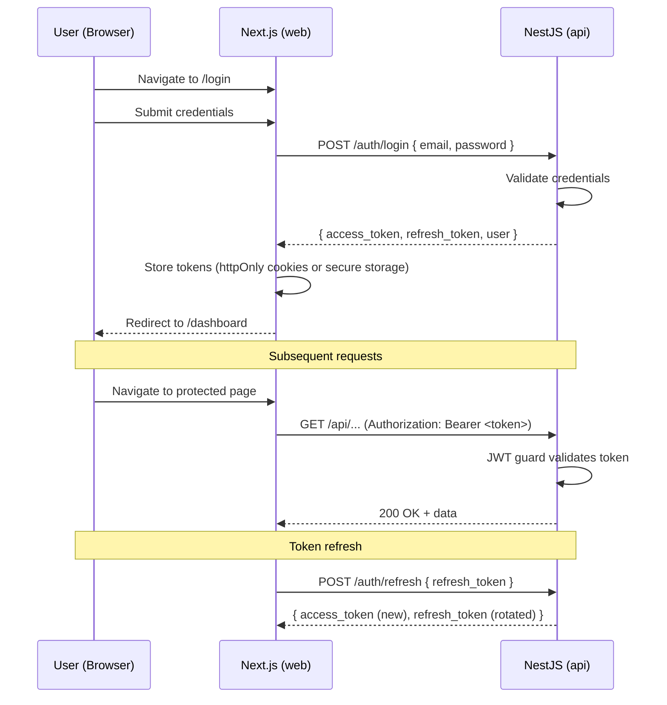

# 3. Frontend Architecture (apps/web)

## 3.1 Next.js 14 App Router Structure

The frontend uses Next.js 14 with the App Router, leveraging Server Components for data-heavy pages and Client Components only where interactivity is required. This follows the frontend spec URL structure exactly (Section 2.3).

```
apps/web/src/
|-- app/
|   |-- (auth)/
|   |   |-- login/page.tsx                 # Login page (Client Component)
|   |   |-- layout.tsx                     # Auth layout (no sidebar)
|   |
|   |-- (main)/
|   |   |-- layout.tsx                     # Main shell: sidebar + topbar + content
|   |   |-- dashboard/page.tsx             # FR-054: Executive Dashboard
|   |   |-- forecast/
|   |   |   |-- page.tsx                   # FR-031: Forecast Dashboard (Volume)
|   |   |   |-- revenue/page.tsx           # FR-028: Revenue Forecast
|   |   |   |-- metrics/page.tsx           # FR-032: Metrics & Backtest
|   |   |   |-- models/page.tsx            # FR-033: Model Metadata
|   |   |   |-- scenarios/page.tsx         # FR-057: What-If
|   |   |-- mrp/
|   |   |   |-- page.tsx                   # FR-043: MRP Gantt
|   |   |   |-- detail/page.tsx            # FR-044: MRP Detail Table
|   |   |   |-- stock/page.tsx             # FR-045: Stock Projection
|   |   |   |-- capacity/page.tsx          # FR-046: Capacity Dashboard
|   |   |   |-- calendar/page.tsx          # FR-048: Factory Calendar
|   |   |-- compras/
|   |   |   |-- page.tsx                   # FR-042: Purchasing Panel
|   |   |   |-- supplier/[id]/page.tsx     # Supplier Summary
|   |   |   |-- history/page.tsx           # Order History
|   |   |-- cadastros/
|   |   |   |-- produtos/
|   |   |   |   |-- page.tsx               # FR-007: Product list
|   |   |   |   |-- [id]/page.tsx          # Product detail/edit
|   |   |   |   |-- import/page.tsx        # FR-008: Mass import
|   |   |   |-- bom/
|   |   |   |   |-- page.tsx               # FR-009/FR-010: BOM tree
|   |   |   |   |-- [id]/page.tsx          # BOM detail
|   |   |   |-- fornecedores/
|   |   |   |   |-- page.tsx               # FR-011: Supplier list
|   |   |   |   |-- [id]/page.tsx          # FR-012: Supplier detail + SKU linkage
|   |   |   |-- capacidade/
|   |   |   |   |-- centros/page.tsx        # FR-013: Work Centers
|   |   |   |   |-- turnos/page.tsx         # FR-014: Shifts
|   |   |   |   |-- paradas/page.tsx        # FR-015: Scheduled Stops
|   |   |   |   |-- eventos/page.tsx        # FR-016: Capacity Events
|   |   |   |   |-- roteiros/page.tsx       # FR-047: Production Routings
|   |   |   |-- depositos/page.tsx          # FR-017: Warehouses
|   |   |-- inventario/
|   |   |   |-- page.tsx                   # FR-018: Inventory table
|   |   |   |-- upload/page.tsx            # FR-018: Spreadsheet upload
|   |   |   |-- classificacao/page.tsx     # FR-020: ABC/XYZ classification
|   |   |-- ingestao/
|   |   |   |-- page.tsx                   # FR-019: Upload + mapping
|   |   |   |-- templates/page.tsx         # FR-061: Saved templates
|   |   |   |-- pipeline/page.tsx          # ETL pipeline status
|   |   |-- automacao/
|   |   |   |-- page.tsx                   # FR-050/FR-051: Email + ERP config
|   |   |   |-- schedule/page.tsx          # FR-052: Pipeline scheduling
|   |   |   |-- log/page.tsx              # Execution log
|   |   |-- config/
|   |   |   |-- page.tsx                   # FR-076: System config
|   |   |   |-- users/page.tsx             # User management
|   |
|   |-- layout.tsx                         # Root layout: providers, fonts
|   |-- globals.css                        # Tailwind base + custom tokens
|
|-- components/
|   |-- ui/                                # Shadcn/UI components (copy-pasted)
|   |   |-- button.tsx
|   |   |-- input.tsx
|   |   |-- badge.tsx
|   |   |-- dialog.tsx
|   |   |-- sheet.tsx
|   |   |-- table.tsx
|   |   |-- select.tsx
|   |   |-- ... (all Shadcn primitives)
|   |
|   |-- molecules/                         # Composed elements
|   |   |-- kpi-card.tsx
|   |   |-- form-field.tsx
|   |   |-- search-input.tsx
|   |   |-- file-upload-zone.tsx
|   |   |-- alert-banner.tsx
|   |   |-- status-badge.tsx
|   |   |-- priority-badge.tsx
|   |   |-- progress-bar.tsx
|   |   |-- currency-display.tsx
|   |   |-- trend-indicator.tsx
|   |
|   |-- organisms/                         # Complex elements
|   |   |-- data-table/
|   |   |   |-- data-table.tsx            # TanStack React Table wrapper
|   |   |   |-- data-table-toolbar.tsx    # Search + filters + bulk actions
|   |   |   |-- data-table-pagination.tsx # Pagination controls
|   |   |   |-- data-table-column-header.tsx
|   |   |-- charts/                        # ECharts wrappers
|   |   |   |-- time-series-chart.tsx
|   |   |   |-- bar-chart.tsx
|   |   |   |-- heatmap-chart.tsx
|   |   |   |-- gantt-chart.tsx
|   |   |   |-- gauge-chart.tsx
|   |   |   |-- pareto-chart.tsx
|   |   |   |-- sparkline-chart.tsx
|   |   |   |-- chart-base.tsx            # Base ECharts component
|   |   |-- forms/                         # Domain-specific forms
|   |   |   |-- product-form.tsx
|   |   |   |-- bom-form.tsx
|   |   |   |-- supplier-form.tsx
|   |   |   |-- work-center-form.tsx
|   |   |-- bom-tree-view.tsx
|   |   |-- column-mapper.tsx
|   |   |-- reconciliation-table.tsx
|   |   |-- alert-center.tsx
|   |   |-- job-progress-panel.tsx
|   |   |-- command-palette.tsx
|   |
|   |-- layouts/                           # Page layout templates
|   |   |-- dashboard-layout.tsx
|   |   |-- crud-list-layout.tsx
|   |   |-- crud-detail-layout.tsx
|   |   |-- split-panel-layout.tsx
|   |   |-- action-panel-layout.tsx
|   |   |-- upload-flow-layout.tsx
|   |
|   |-- shell/                             # Application shell
|   |   |-- sidebar.tsx
|   |   |-- topbar.tsx
|   |   |-- breadcrumbs.tsx
|
|-- lib/
|   |-- api/
|   |   |-- client.ts                      # Axios/fetch API client with interceptors
|   |   |-- endpoints.ts                   # API endpoint definitions
|   |   |-- types.ts                       # Re-export from packages/shared
|   |-- hooks/
|   |   |-- use-debounce.ts
|   |   |-- use-websocket.ts              # WebSocket connection hook
|   |   |-- use-job-progress.ts           # ML job progress hook
|   |-- queries/                           # React Query query/mutation definitions
|   |   |-- products.ts
|   |   |-- suppliers.ts
|   |   |-- forecasts.ts
|   |   |-- mrp.ts
|   |   |-- ... (per domain)
|   |-- stores/                            # Zustand stores (minimal client state)
|   |   |-- sidebar-store.ts
|   |   |-- filter-store.ts
|   |   |-- auth-store.ts
|   |-- utils/
|   |   |-- format.ts                      # Brazilian number/date/currency formatting
|   |   |-- cn.ts                          # Tailwind class merge utility
|   |   |-- validators.ts                  # CNPJ validation, etc.
|
|-- providers/
|   |-- query-provider.tsx                 # React Query provider
|   |-- auth-provider.tsx                  # Authentication context
|   |-- theme-provider.tsx                 # Light/dark theme
|   |-- websocket-provider.tsx             # Socket.IO connection
```

## 3.2 Server Components vs Client Components Strategy

**Design principle:** Server Components by default. Client Components only when the component requires browser APIs, user interaction state, or real-time updates.

| Component Type | Rendering | When to Use | Examples |
|---------------|-----------|-------------|---------|
| **Server Component** | Server-side (default) | Data fetching, static display, SEO-relevant content | Dashboard page, CRUD list pages, KPI cards |
| **Client Component** | Client-side (`"use client"`) | Interactivity, browser APIs, useState/useEffect | Charts (ECharts), forms, filters, WebSocket consumers |
| **Streaming SSR** | Progressive (`<Suspense>`) | Independent sections that can load in parallel | Dashboard: KPIs load before charts |

**Boundaries:**

```
Page (Server Component)
  |-- KPI Cards (Server Component -- data fetched on server)
  |-- <Suspense fallback={<ChartSkeleton />}>
  |     |-- ChartSection (Client Component -- needs ECharts)
  |-- <Suspense fallback={<TableSkeleton />}>
  |     |-- DataTableSection (Client Component -- needs sorting/filtering)
  |-- AlertSidebar (Server Component -- static data)
```

## 3.3 State Management Approach

**Three-tier state management:**

| Tier | Tool | Scope | Purpose |
|------|------|-------|---------|
| **Server State** | TanStack React Query v5 | Server cache | All API data: entities, forecasts, MRP results. Handles caching (5 min staleTime), invalidation, optimistic updates, pagination. |
| **Client State** | Zustand | Cross-component UI state | Sidebar open/collapsed, active filters, selected rows, theme preference. Minimal -- avoids duplicating server state. |
| **URL State** | Next.js searchParams | URL-persisted state | Active tab, pagination page, sort column/direction, filter values. Enables shareable/bookmarkable views. |

**React Query configuration:**

```typescript
const queryClient = new QueryClient({
  defaultOptions: {
    queries: {
      staleTime: 5 * 60 * 1000,     // 5 min -- matches Redis cache TTL
      gcTime: 10 * 60 * 1000,        // 10 min garbage collection
      retry: 2,
      refetchOnWindowFocus: true,     // Refresh on tab return
    },
  },
});
```

## 3.4 API Client Layer Design

The API client is a thin Axios wrapper with JWT interceptor and consistent error handling.

```typescript
// lib/api/client.ts
import axios from 'axios';

const apiClient = axios.create({
  baseURL: process.env.NEXT_PUBLIC_API_URL || 'http://localhost:3001',
  timeout: 30000,
  headers: { 'Content-Type': 'application/json' },
});

// Request interceptor: attach JWT
apiClient.interceptors.request.use((config) => {
  const token = getStoredToken();
  if (token) config.headers.Authorization = `Bearer ${token}`;
  return config;
});

// Response interceptor: handle 401 (refresh) and errors
apiClient.interceptors.response.use(
  (response) => response,
  async (error) => {
    if (error.response?.status === 401) {
      const newToken = await refreshToken();
      if (newToken) {
        error.config.headers.Authorization = `Bearer ${newToken}`;
        return apiClient(error.config);
      }
      redirectToLogin();
    }
    throw transformApiError(error);
  },
);
```

## 3.5 ECharts Integration Pattern (SSR-Safe)

ECharts is loaded dynamically to avoid SSR issues (it requires `window`/`document`).

```typescript
// components/organisms/charts/chart-base.tsx
'use client';

import dynamic from 'next/dynamic';
import { Skeleton } from '@/components/ui/skeleton';

// Dynamic import prevents SSR execution of ECharts
const ReactECharts = dynamic(() => import('echarts-for-react'), {
  ssr: false,
  loading: () => <Skeleton className="h-[400px] w-full" />,
});

// Selective ECharts module registration to reduce bundle size
import * as echarts from 'echarts/core';
import { LineChart, BarChart, HeatmapChart, CustomChart } from 'echarts/charts';
import { GridComponent, TooltipComponent, LegendComponent,
         DataZoomComponent, ToolboxComponent } from 'echarts/components';
import { CanvasRenderer } from 'echarts/renderers';

echarts.use([
  LineChart, BarChart, HeatmapChart, CustomChart,
  GridComponent, TooltipComponent, LegendComponent,
  DataZoomComponent, ToolboxComponent,
  CanvasRenderer,
]);
```

## 3.6 WebSocket Integration for Real-Time Updates

Socket.IO connection for ML job progress events (FR-030) and real-time alerts (FR-062).

```typescript
// providers/websocket-provider.tsx
'use client';

import { io, Socket } from 'socket.io-client';
import { createContext, useContext, useEffect, useRef } from 'react';

const socket = io(process.env.NEXT_PUBLIC_WS_URL || 'http://localhost:3001', {
  transports: ['websocket'],
  autoConnect: false,
  auth: { token: '' },  // Set on auth
});

// Events consumed:
// - 'job:progress'   -> { step, totalSteps, stepName, processed, total, percent }
// - 'job:completed'  -> { duration, results_summary }
// - 'job:failed'     -> { error, step }
// - 'alert:new'      -> { type, severity, message, entity_id }
```

## 3.7 Authentication Flow



**Middleware (Next.js):** A `middleware.ts` file at the app root checks for valid JWT on every request to `(main)` routes. If the token is missing or expired, it redirects to `/login`.

## 3.8 Route Structure Mapping to PRD Screens

| Route | PRD Reference | Screen | Epic |
|-------|---------------|--------|------|
| `/dashboard` | FR-054 | Executive Dashboard | 4 |
| `/forecast` | FR-031 | Forecast Dashboard (Volume) | 2 |
| `/forecast/revenue` | FR-028 | Revenue Forecast | 2 |
| `/forecast/metrics` | FR-032 | Metrics & Backtest | 2 |
| `/forecast/models` | FR-033 | Model Metadata | 2 |
| `/forecast/scenarios` | FR-057 | What-If Analysis | 4 |
| `/mrp` | FR-043 | MRP Gantt | 3 |
| `/mrp/detail` | FR-044 | MRP Detail Table | 3 |
| `/mrp/stock` | FR-045 | Stock Projection | 3 |
| `/mrp/capacity` | FR-046 | Capacity Dashboard | 3 |
| `/mrp/calendar` | FR-048 | Factory Calendar | 3 |
| `/compras` | FR-042 | Purchasing Panel | 3 |
| `/cadastros/produtos` | FR-007 | Product CRUD | 1 |
| `/cadastros/bom` | FR-009, FR-010 | BOM CRUD | 1 |
| `/cadastros/fornecedores` | FR-011, FR-012 | Supplier CRUD | 1 |
| `/cadastros/capacidade/*` | FR-013 to FR-016, FR-047 | Capacity Management | 1/3 |
| `/cadastros/depositos` | FR-017 | Warehouse CRUD | 1 |
| `/inventario` | FR-018 | Inventory Management | 1 |
| `/inventario/classificacao` | FR-020 | ABC/XYZ Classification | 1 |
| `/ingestao` | FR-019 | Data Ingestion | 1 |
| `/automacao` | FR-050 to FR-052 | Automation Config | 4 |
| `/config` | FR-076 | System Configuration | 5 |

---
