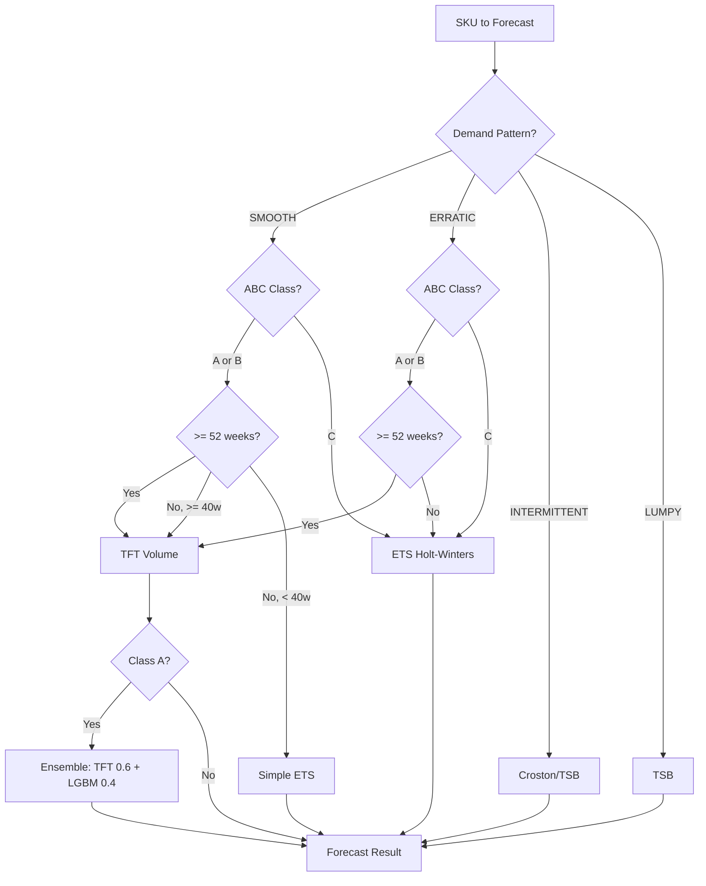
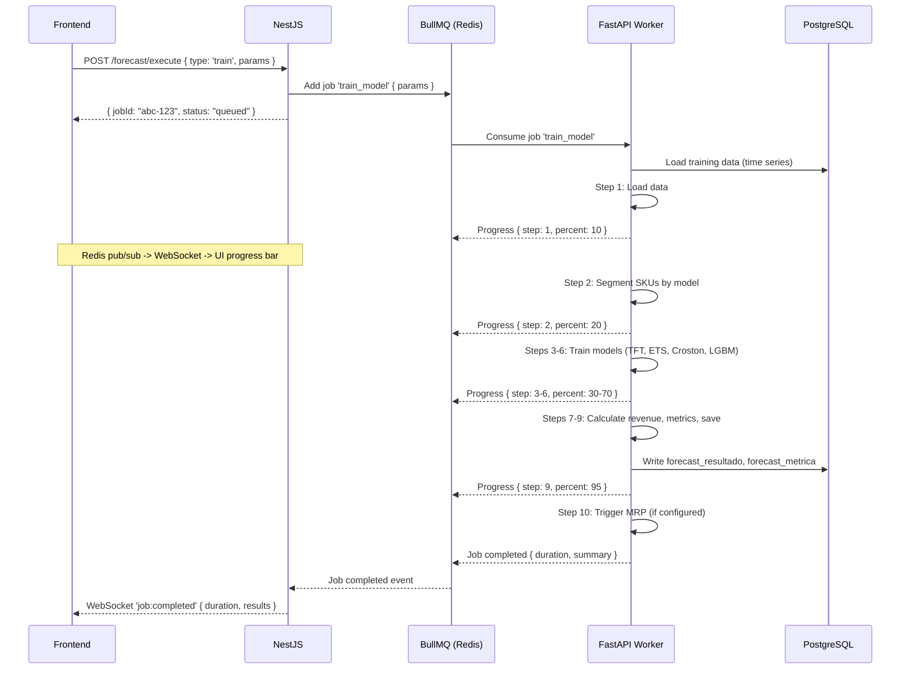

# 5. ML/Forecasting Architecture (apps/forecast-engine)

## 5.1 FastAPI Service Structure

```
apps/forecast-engine/src/
|-- api/
|   |-- router.py                  # FastAPI router aggregation
|   |-- routes/
|   |   |-- health.py              # GET /health
|   |   |-- train.py               # POST /train (sync trigger for BullMQ job)
|   |   |-- predict.py             # POST /predict (sync inference, < 5s)
|   |   |-- backtest.py            # POST /backtest
|   |   |-- models_meta.py         # GET /models (metadata, versions)
|
|-- models/
|   |-- base.py                    # Abstract base model interface
|   |-- tft/
|   |   |-- tft_model.py           # TFT (PyTorch Forecasting) wrapper
|   |   |-- tft_config.py          # Hyperparameters
|   |   |-- tft_dataset.py         # TimeSeriesDataSet preparation
|   |-- ets/
|   |   |-- ets_model.py           # Holt-Winters (statsmodels)
|   |-- croston/
|   |   |-- croston_model.py       # Croston/TSB implementation
|   |-- lightgbm/
|   |   |-- lgbm_model.py          # LightGBM (scikit-learn API)
|   |   |-- lgbm_features.py       # Feature engineering
|   |-- ensemble/
|   |   |-- ensemble_model.py      # Weighted ensemble (TFT 0.6 + LGBM 0.4)
|   |-- registry.py                # Model registry (selection by classification)
|
|-- pipeline/
|   |-- executor.py                # 10-step pipeline orchestrator (FR-027)
|   |-- steps/
|   |   |-- step_01_load_data.py
|   |   |-- step_02_segment.py     # Route SKUs to models by classification
|   |   |-- step_03_tft.py         # TFT volume + revenue
|   |   |-- step_04_ets.py
|   |   |-- step_05_croston.py
|   |   |-- step_06_lgbm_ensemble.py
|   |   |-- step_07_forecast_revenue.py
|   |   |-- step_08_metrics.py     # Backtesting metrics
|   |   |-- step_09_save.py
|   |   |-- step_10_trigger_mrp.py
|
|-- features/
|   |-- feature_engine.py          # Feature engineering pipeline
|   |-- temporal_features.py       # Lags, rolling stats, calendar features
|   |-- classification.py          # ABC/XYZ/demand pattern classification (FR-020)
|
|-- backtesting/
|   |-- backtester.py              # Train T-13, predict 13 weeks, compare (FR-029)
|   |-- metrics.py                 # MAPE, MAE, RMSE calculation
|
|-- workers/
|   |-- bullmq_consumer.py         # BullMQ job consumer (redis queue)
|   |-- progress_reporter.py       # Redis pub/sub progress events
|
|-- db/
|   |-- database.py                # SQLAlchemy async engine + session
|   |-- repositories/
|   |   |-- time_series_repo.py    # Read clean time series data
|   |   |-- forecast_repo.py       # Write forecast results
|   |   |-- model_meta_repo.py     # Model metadata CRUD
|
|-- config.py                      # Pydantic Settings (env-based)
|-- main.py                        # FastAPI app + lifespan events
```

## 5.2 Model Architecture

### Model Selection Matrix (FR-022)



### Model Specifications

| Model | Library | Target | Quantiles | Training | Inference | Hardware |
|-------|---------|--------|-----------|----------|-----------|----------|
| **TFT Volume** | pytorch_forecasting | Weekly volume | P10, P25, P50, P75, P90 | Monthly (30-60 min) | Weekly (< 30s) | GPU train, CPU infer |
| **TFT Revenue** | pytorch_forecasting | Weekly revenue | P10, P25, P50, P75, P90 | Monthly | Weekly | GPU train, CPU infer |
| **ETS** | statsmodels | Weekly volume | Via simulation (1000 paths) | Per-SKU fit (~1s) | Immediate | CPU |
| **Croston/TSB** | Custom / statsforecast | Inter-demand interval + size | Via bootstrap | Per-SKU fit (~0.5s) | Immediate | CPU |
| **LightGBM** | lightgbm (sklearn API) | Weekly volume | Via quantile regression | Monthly (~5 min) | < 5s | CPU |
| **Ensemble** | Custom weighted average | Weekly volume | Weighted quantiles | N/A (uses sub-models) | < 1s | CPU |

## 5.3 Training Pipeline (BullMQ Workers)



## 5.4 Prediction Pipeline (REST Sync)

For inference-only calls (daily pipeline), the NestJS backend calls FastAPI synchronously:

```
POST http://forecast-engine:8000/predict
{
  "sku_ids": ["uuid-1", "uuid-2", ...],  // or null for all
  "horizon_weeks": 13,
  "models": "auto",  // or specific model override
  "targets": ["VOLUME", "FATURAMENTO"]
}

Response (< 5s):
{
  "execution_id": "uuid",
  "results_count": 1234,
  "duration_ms": 3200,
  "summary": {
    "tft_count": 450,
    "ets_count": 600,
    "croston_count": 184
  }
}
```

## 5.5 Model Versioning and Storage

| Artifact | Storage | Naming Convention | Retention |
|----------|---------|-------------------|-----------|
| TFT checkpoint (.ckpt) | `data/models/tft/` | `tft_volume_v{N}_{date}.ckpt` | Last 5 versions |
| TFT Revenue checkpoint | `data/models/tft/` | `tft_revenue_v{N}_{date}.ckpt` | Last 5 versions |
| LightGBM model (.pkl) | `data/models/lgbm/` | `lgbm_v{N}_{date}.pkl` | Last 5 versions |
| Model metadata | PostgreSQL (`forecast_modelo` table) | By `execucao_id` | Indefinite |
| Training metrics | PostgreSQL (`forecast_metrica` table) | By `execucao_id` | Indefinite |

**Champion-Challenger (FR-066):** The model registry tracks the current "champion" model for each model type. New models are promoted only if their backtesting MAPE improves by at least 1 percentage point (configurable).

## 5.6 Feature Engineering Pipeline

| Feature Category | Features | Source |
|-----------------|----------|--------|
| **Temporal** | week_of_year, month, quarter, is_holiday, days_to_holiday | calendario_fabrica |
| **Lag** | lag_1w, lag_2w, lag_4w, lag_8w, lag_13w, lag_26w, lag_52w | Clean time series |
| **Rolling Stats** | rolling_mean_4w, rolling_mean_13w, rolling_std_4w, rolling_std_13w | Clean time series |
| **Price** | current_price, avg_price_3m, price_change_pct | produto.preco_venda |
| **Classification** | abc_class, xyz_class, demand_pattern | sku_classification |
| **Categorical** | categoria_id, tipo_produto (encoded) | produto |

## 5.7 NestJS <-> FastAPI Communication Summary

| Use Case | Protocol | Direction | Latency | Example |
|----------|----------|-----------|---------|---------|
| Inference (predict) | REST sync | NestJS -> FastAPI | < 5s | Daily pipeline prediction |
| Training | BullMQ async | NestJS -> Queue -> FastAPI | N/A | Monthly model retraining |
| Progress events | Redis pub/sub | FastAPI -> Redis -> NestJS -> WebSocket -> Frontend | < 100ms | Training progress bar |
| Health check | REST sync | NestJS -> FastAPI | < 200ms | Pipeline pre-check |

---
