# 6. Data Architecture

## 6.1 PostgreSQL 16 Schema Overview

The database schema implements all 26 tables defined in PRD Section 3 (v2.1), organized into five groups:

```mermaid
erDiagram
    %% Registration Tables
    produto ||--o{ bom : "parent/child"
    produto ||--o{ produto_fornecedor : "has suppliers"
    produto }o--|| categoria : "belongs to"
    produto }o--|| unidade_medida : "uses"
    fornecedor ||--o{ produto_fornecedor : "supplies"
    produto ||--o{ inventario_atual : "stored in"
    deposito ||--o{ inventario_atual : "contains"
    produto ||--o{ roteiro_producao : "manufactured via"
    centro_trabalho ||--o{ roteiro_producao : "performs"
    centro_trabalho ||--o{ turno : "has shifts"
    centro_trabalho ||--o{ parada_programada : "has stops"
    centro_trabalho ||--o{ evento_capacidade : "has events"

    %% Result Tables
    execucao_planejamento ||--o{ execucao_step_log : "has steps"
    execucao_planejamento ||--o{ forecast_resultado : "produces"
    execucao_planejamento ||--o{ forecast_metrica : "measures"
    execucao_planejamento ||--o{ forecast_modelo : "trains"
    execucao_planejamento ||--o{ parametros_estoque : "calculates"
    execucao_planejamento ||--o{ ordem_planejada : "generates"
    execucao_planejamento ||--o{ carga_capacidade : "validates"

    %% Classification & Time Series
    produto ||--|| sku_classification : "classified as"
    produto ||--o{ serie_temporal : "has time series"

    %% System Tables
    usuario ||--o{ execucao_planejamento : "triggers"
    usuario ||--o{ evento_capacidade : "records"
```



## 6.2 Table Groups

| Group | Tables | Count | Purpose |
|-------|--------|-------|---------|
| **Registration** | produto, categoria, unidade_medida, fornecedor, produto_fornecedor, bom, deposito | 7 | Master data |
| **Capacity** | centro_trabalho, turno, parada_programada, evento_capacidade, roteiro_producao, calendario_fabrica | 6 | Production capacity |
| **Inventory** | inventario_atual | 1 | Current stock positions |
| **Results** | execucao_planejamento, execucao_step_log, forecast_resultado, forecast_metrica, forecast_modelo, parametros_estoque, ordem_planejada, carga_capacidade | 8 | Calculation outputs |
| **Classification** | sku_classification, serie_temporal | 2 | ML input/output data |
| **System** | config_sistema, usuario | 2 | Configuration + auth |

## 6.3 TimescaleDB Hypertable Strategy

**Candidate tables for hypertables** (time-series-heavy, high write volume):

| Table | Partition Column | Chunk Interval | Rationale |
|-------|-----------------|----------------|-----------|
| `forecast_resultado` | `periodo` | 1 month | Weekly forecasts across 5K SKUs x 13 weeks = 65K rows/execution |
| `execucao_step_log` | `started_at` | 1 week | High-volume pipeline step logs |

**Decision:** Start without TimescaleDB hypertables (Phase 0-3). Enable in Phase 5 if query performance requires it (NFR-027). The Docker Compose already uses the `timescale/timescaledb:latest-pg16` image, so the extension is available.

```sql
-- Enable when needed (Phase 5):
CREATE EXTENSION IF NOT EXISTS timescaledb;
SELECT create_hypertable('forecast_resultado', 'periodo', chunk_time_interval => INTERVAL '1 month');
```

## 6.4 Index Strategy

| Table | Index | Type | Purpose |
|-------|-------|------|---------|
| `produto` | `idx_produto_codigo` | UNIQUE B-tree | SKU lookup |
| `produto` | `idx_produto_tipo_ativo` | B-tree composite | Filter by type + active |
| `produto` | `idx_produto_categoria` | B-tree | Filter by category |
| `bom` | `idx_bom_pai_ativo` | B-tree composite | BOM explosion query |
| `bom` | `idx_bom_filho` | B-tree | Reverse BOM (where-used) |
| `inventario_atual` | `idx_inv_produto_deposito` | UNIQUE composite | Stock lookup |
| `forecast_resultado` | `idx_forecast_exec_produto` | B-tree composite | Forecast result query |
| `forecast_resultado` | `idx_forecast_periodo` | B-tree | Time-range queries |
| `ordem_planejada` | `idx_ordem_exec_tipo` | B-tree composite | Order listing by type |
| `ordem_planejada` | `idx_ordem_prioridade` | B-tree | Priority sorting |
| `ordem_planejada` | `idx_ordem_data_liberacao` | B-tree | Date-range queries |
| `carga_capacidade` | `idx_carga_centro_periodo` | B-tree composite | Capacity heatmap query |
| `config_sistema` | PRIMARY KEY (chave) | B-tree | Key-value lookup |
| `execucao_planejamento` | `idx_exec_tipo_status` | B-tree composite | Pipeline monitoring |

**JSONB indexes** (GIN) for flexible querying:

```sql
CREATE INDEX idx_exec_parametros ON execucao_planejamento USING GIN (parametros);
CREATE INDEX idx_exec_resultado ON execucao_planejamento USING GIN (resultado_resumo);
CREATE INDEX idx_config_valor ON config_sistema USING GIN (valor);
```

## 6.5 Migration Strategy

**Tool:** Prisma Migrate (integrated with NestJS).

**Workflow:**
1. Modify `prisma/schema.prisma`
2. Run `npx prisma migrate dev --name {description}` (generates SQL migration)
3. Migration files stored in `prisma/migrations/` (version-controlled)
4. Production: `npx prisma migrate deploy` (applies pending migrations)

**Migration naming convention:** `{timestamp}_{description}` (e.g., `20260301_add_forecast_modelo_table`)

## 6.6 Seed Data Approach (FR-005)

The seed script (`prisma/seed.ts`) generates coherent synthetic data:

| Entity | Volume | Notes |
|--------|--------|-------|
| Categorias | 15 | 3-level hierarchy |
| Unidades de medida | 8 | UN, KG, LT, CX, MT, M2, M3, PCT |
| Produtos | 1,000 | Distributed across all types |
| Fornecedores | 50 | With realistic lead times |
| Produto-Fornecedor | 2,000 | 2-4 suppliers per product |
| BOM | 500 | 3-level structures for finished goods |
| Centros de trabalho | 5 | PRODUCAO, EMBALAGEM, MONTAGEM, ACABAMENTO, CQ |
| Turnos | 10 | 2 shifts per center |
| Depositos | 5 | By warehouse type |
| Inventario | 1,000 | One position per product |
| Calendario fabrica | 365 | Full year with holidays |
| Config sistema | 15 | Default configuration values |
| Usuarios | 6 | One per persona role |

## 6.7 Connection Pooling

**Development:** Prisma's built-in connection pool (default: 10 connections).

**Production:** PgBouncer in transaction pooling mode:
- Max client connections: 200
- Max server connections: 20
- Pool mode: transaction
- Deployed as a sidecar container in EKS

---
