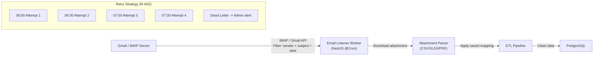

# 9. Integration Patterns

## 9.1 Email Integration (FR-050)



**Adapters (Strategy pattern):**
- `GmailAdapter`: Google OAuth2 + Gmail API (recommended)
- `ImapAdapter`: IMAP connection via `imapflow` (Node.js)
- `SftpAdapter`: SFTP folder monitoring (fallback)

## 9.2 ERP Connector Pattern (FR-051)

The ERP connector uses the **Adapter pattern** -- three implementations behind a common interface:

```typescript
interface ErpConnector {
  fetchDailyData(date: Date): Promise<RawMovementData[]>;
  testConnection(): Promise<boolean>;
}

class RestApiConnector implements ErpConnector { ... }
class DirectDbConnector implements ErpConnector { ... }   // Read-only (NFR-020)
class SftpConnector implements ErpConnector { ... }
```

**Configuration:** The active connector is selected via `config_sistema` (`automacao.erp.tipo`). Multiple connectors can be configured as primary + fallback.

## 9.3 Export Patterns (FR-058)

| Format | Library | Generation | Delivery |
|--------|---------|-----------|----------|
| **Excel (.xlsx)** | `exceljs` (NestJS) | Server-side streaming | Download endpoint |
| **PDF** | `@react-pdf/renderer` or `puppeteer` | Server-side rendering | Download endpoint |
| **CSV** | Native streaming | Server-side | Download endpoint |

**For large exports:** Backend generates the file asynchronously via BullMQ job, stores in temp directory (or S3 in production), and returns a download URL.

## 9.4 Webhook Patterns for Notifications (FR-062)

Internal notification system using Redis pub/sub + WebSocket:

```
Event Source (any module)
  -> NotificacaoService.create({ type, severity, message, entityId })
    -> PostgreSQL (persist alert)
    -> Redis pub/sub (real-time channel)
      -> WebSocket Gateway (push to connected clients)
        -> Frontend (toast notification + alert badge update)
```

---
