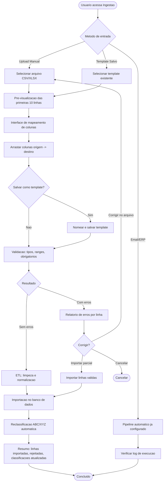
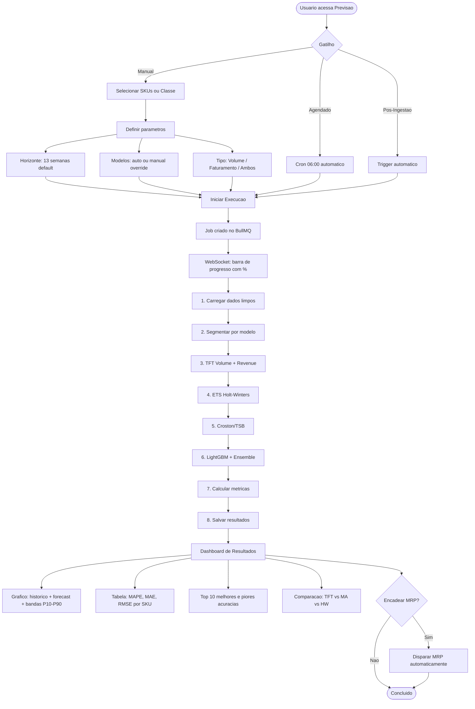
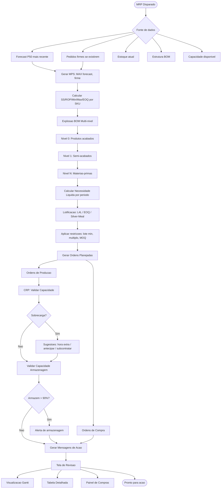
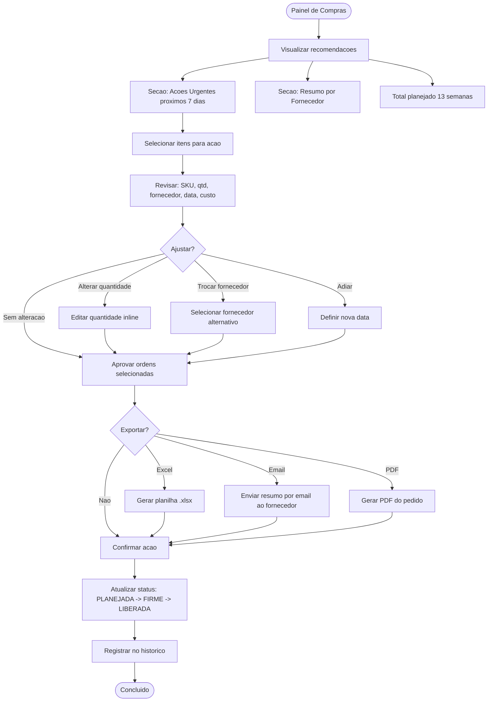
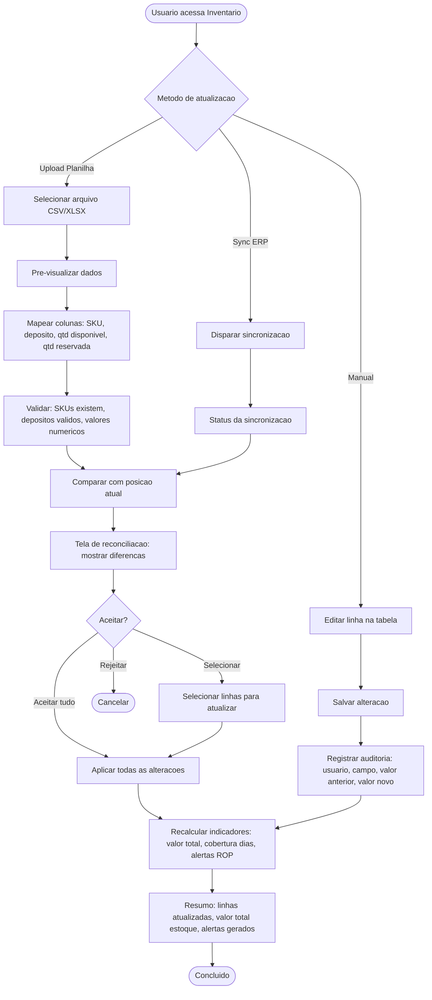

# Frontend UI/UX Specification -- ForecastingMRP

## Metadata

| Field | Value |
|-------|-------|
| **Project** | ForecastingMRP -- Industrial Forecasting + MRP/MRP II + BI System |
| **Document** | Frontend UI/UX Specification |
| **Version** | 1.0 |
| **Date** | February 2026 |
| **Author** | Uma (UX/UI Design Agent, Synkra AIOS) |
| **Status** | Draft |
| **Tech Stack** | Next.js 14 (App Router) + Tailwind CSS + Shadcn/UI + Apache ECharts |
| **PRD Reference** | `docs/prd.md` v2.1 (FR-001 through FR-076, NFR-001 through NFR-029, CON-001 through CON-013) |
| **Language** | Portuguese (CON-009) |
| **Currency** | BRL (CON-010) |

---

## 1. Introduction & UX Goals

### 1.1 Target User Personas

Based on PRD Section 1.4, six user personas drive all design decisions:

| Persona | Role | Usage Pattern | Primary Screens | Key UX Need |
|---------|------|---------------|-----------------|-------------|
| **Paulo** (Purchasing Manager) | Makes daily/weekly buying decisions | Daily, 30-60 min sessions | Purchasing Panel, MRP Dashboard, Inventory | Speed to decision: see what to buy, approve, export in < 10 min |
| **Priscila** (Production Planner) | Schedules production across work centers | Daily, extended sessions | Capacity Dashboard, MRP Gantt, Calendar | Overload visibility: instantly see bottlenecks and resolution suggestions |
| **Diego** (Operations Director) | Oversees manufacturing operations | Daily quick check, weekly deep dive | Executive Dashboard, Forecast, Alerts | Glanceable KPIs: morning briefing in under 2 minutes |
| **Fernanda** (Financial Controller) | Revenue forecasts and budgets | Weekly/Monthly, analysis sessions | Forecast Dashboard (Revenue), Export | Confidence intervals: scenario exploration with exportable reports |
| **Ivan** (Inventory Analyst) | Manages stock levels and cycle counts | Daily, data-entry + monitoring | Inventory, Classification, Upload | Bulk operations: upload, reconcile, confirm with minimal friction |
| **Tiago** (IT/Systems Admin) | Configures integrations and pipelines | As needed, configuration sessions | Config/Admin, Ingestion, Automation | System health: clear status indicators and error diagnostics |

### 1.2 Usability Goals

| Goal | Metric | Target | Rationale |
|------|--------|--------|-----------|
| **Time-to-decision** | Time from alert to action (purchase order) | < 10 min | PRD user metric |
| **Daily active usage** | % of purchasing/planning team using daily | 100% | PRD user metric |
| **Manual override rate** | % of forecast recommendations manually overridden | < 15% | High trust in system output |
| **Dashboard adoption** | Daily executive dashboard check rate | > 90% | Glanceability drives adoption |
| **Task completion (CRUD)** | Time to complete a standard CRUD operation | < 30 sec | Efficient data management |
| **Learnability** | Time for new user to complete core tasks | < 2 hours | Industrial users, limited training time |

### 1.3 Design Principles

1. **Data Density Without Overload** -- Industrial BI demands dense information displays. Use progressive disclosure: summary first, detail on demand. Every screen has a clear visual hierarchy with the most actionable data at the top.

2. **Actionable Over Informational** -- Every dashboard element should answer "what do I do next?" Purchase recommendations come with buttons. Alerts come with resolution suggestions. Overloads come with alternatives. Information without action is noise.

3. **Trust Through Transparency** -- Show the "why" behind every AI recommendation. Display confidence intervals, model accuracy metrics, and data quality scores alongside forecasts. Allow manual overrides with audit logging (FR-068). Users who trust the system use it.

4. **Zero Ambiguity in Critical Data** -- Monetary values always show currency (R$), dates always include context ("Pedir ate 03/Mar"), quantities always show units. Color coding follows established industrial conventions: red = critical, amber = attention, green = normal.

5. **Keyboard-First for Power Users** -- Purchasing managers and planners use the system 30-60 minutes daily. Support keyboard shortcuts for navigation (Cmd/Ctrl+K for search), bulk selection, and rapid approval workflows. Mouse is fallback, not primary.

---

## 2. Information Architecture (IA)

### 2.1 Site Map

```mermaid
graph TD
    ROOT[ForecastingMRP] --> AUTH[Login / Auth]
    ROOT --> MAIN[Main Application Shell]

    MAIN --> DASH[Dashboard Executivo]
    MAIN --> FORECAST[Previsao]
    MAIN --> MRP_SEC[MRP / Planejamento]
    MAIN --> COMPRAS[Compras]
    MAIN --> CADASTROS[Cadastros]
    MAIN --> INVENTARIO[Inventario]
    MAIN --> INGESTAO[Ingestao de Dados]
    MAIN --> AUTOMACAO[Automacao]
    MAIN --> CONFIG[Configuracoes]

    DASH --> DASH_EXEC[Visao Executiva]
    DASH --> DASH_ALERTS[Central de Alertas]

    FORECAST --> FORECAST_VOLUME[Forecast Volume]
    FORECAST --> FORECAST_REVENUE[Forecast Faturamento]
    FORECAST --> FORECAST_METRICS[Metricas de Acuracia]
    FORECAST --> FORECAST_MODELS[Modelos / Backtest]
    FORECAST --> FORECAST_WHATIF[Cenarios What-If]

    MRP_SEC --> MRP_GANTT[Gantt de Ordens]
    MRP_SEC --> MRP_DETAIL[Tabela Detalhada MRP]
    MRP_SEC --> MRP_STOCK[Projecao de Estoque]
    MRP_SEC --> MRP_CAPACITY[Capacidade / CRP]
    MRP_SEC --> MRP_CALENDAR[Calendario Fabrica]

    COMPRAS --> COMPRAS_PANEL[Painel de Compras]
    COMPRAS --> COMPRAS_URGENT[Acoes Urgentes]
    COMPRAS --> COMPRAS_SUPPLIER[Resumo por Fornecedor]
    COMPRAS --> COMPRAS_HISTORY[Historico de Ordens]

    CADASTROS --> CAD_PRODUTOS[Produtos]
    CADASTROS --> CAD_BOM[Estrutura BOM]
    CADASTROS --> CAD_FORNECEDORES[Fornecedores]
    CADASTROS --> CAD_CAPACIDADE[Capacidade Produtiva]
    CADASTROS --> CAD_DEPOSITOS[Depositos]

    CAD_CAPACIDADE --> CAP_CENTROS[Centros de Trabalho]
    CAD_CAPACIDADE --> CAP_TURNOS[Turnos]
    CAD_CAPACIDADE --> CAP_PARADAS[Paradas Programadas]
    CAD_CAPACIDADE --> CAP_EVENTOS[Eventos de Capacidade]
    CAD_CAPACIDADE --> CAP_ROTEIROS[Roteiros de Producao]

    INVENTARIO --> INV_TABLE[Posicao Atual]
    INVENTARIO --> INV_UPLOAD[Upload de Planilha]
    INVENTARIO --> INV_CLASSIF[Classificacao ABC/XYZ]

    INGESTAO --> ING_UPLOAD[Upload Manual]
    INGESTAO --> ING_MAPPING[Mapeamento de Colunas]
    INGESTAO --> ING_ETL[Pipeline ETL]
    INGESTAO --> ING_TEMPLATES[Templates de Mapeamento]

    AUTOMACAO --> AUTO_EMAIL[Configuracao de Email]
    AUTOMACAO --> AUTO_ERP[Conector ERP]
    AUTOMACAO --> AUTO_SCHEDULE[Agendamento Pipeline]
    AUTOMACAO --> AUTO_LOG[Log de Execucoes]

    CONFIG --> CFG_SYSTEM[Parametros do Sistema]
    CONFIG --> CFG_USERS[Usuarios e Permissoes]
    CONFIG --> CFG_FORECAST[Parametros de Forecast]
    CONFIG --> CFG_MRP[Parametros MRP]
```



### 2.2 Navigation Structure

**Primary Navigation:** Fixed left sidebar (collapsible to icons only).

| # | Label | Icon | Route | Badge |
|---|-------|------|-------|-------|
| 1 | Dashboard | `LayoutDashboard` | `/dashboard` | -- |
| 2 | Previsao | `TrendingUp` | `/forecast` | -- |
| 3 | MRP | `GitBranch` | `/mrp` | -- |
| 4 | Compras | `ShoppingCart` | `/compras` | Count of urgent actions |
| 5 | Cadastros | `Database` | `/cadastros` | -- |
| 6 | Inventario | `Package` | `/inventario` | Items below ROP count |
| 7 | Ingestao | `Upload` | `/ingestao` | -- |
| 8 | Automacao | `Zap` | `/automacao` | Pipeline status indicator |
| 9 | Configuracoes | `Settings` | `/config` | -- |

**Secondary Navigation:** Breadcrumbs at top of content area. Format: `Home > Cadastros > Produtos > SKU-001234`

**Utility Bar (Top Right):**
- Command palette trigger (Ctrl+K / Cmd+K)
- Notification bell (count badge)
- User avatar + role dropdown
- Theme toggle (light/dark -- for late shift operators)

**Quick Actions (Floating):**
- Keyboard shortcut: `Ctrl+K` opens global search/command palette
- Search across all entities: products, suppliers, orders, SKUs
- Quick navigation: type screen name to jump directly

### 2.3 URL Structure (Next.js App Router)

```
app/
  (auth)/
    login/page.tsx
  (main)/
    layout.tsx                    # Shell with sidebar + topbar
    dashboard/page.tsx            # FR-054: Executive Dashboard
    forecast/
      page.tsx                    # FR-031: Forecast Dashboard (Volume)
      revenue/page.tsx            # FR-028: Revenue Forecast
      metrics/page.tsx            # FR-032: Metrics & Backtest
      models/page.tsx             # FR-033: Model Metadata
      scenarios/page.tsx          # FR-057: What-If
    mrp/
      page.tsx                    # FR-043: MRP Gantt
      detail/page.tsx             # FR-044: MRP Detail Table
      stock/page.tsx              # FR-045: Stock Projection
      capacity/page.tsx           # FR-046: Capacity Dashboard
      calendar/page.tsx           # FR-048: Factory Calendar
    compras/
      page.tsx                    # FR-042: Purchasing Panel
      supplier/[id]/page.tsx      # FR-042: Supplier Summary
      history/page.tsx            # Order history
    cadastros/
      produtos/
        page.tsx                  # FR-007: Product list
        [id]/page.tsx             # FR-007: Product detail/edit
        import/page.tsx           # FR-008: Mass import
      bom/
        page.tsx                  # FR-009/FR-010: BOM tree
        [id]/page.tsx             # BOM detail
      fornecedores/
        page.tsx                  # FR-011: Supplier list
        [id]/page.tsx             # FR-011/FR-012: Supplier detail + SKU linkage
      capacidade/
        centros/page.tsx          # FR-013: Work Centers
        turnos/page.tsx           # FR-014: Shifts
        paradas/page.tsx          # FR-015: Scheduled Stops
        eventos/page.tsx          # FR-016: Capacity Events
        roteiros/page.tsx         # FR-047: Production Routings
      depositos/page.tsx          # FR-017: Warehouses
    inventario/
      page.tsx                    # FR-018: Inventory table
      upload/page.tsx             # FR-018: Spreadsheet upload
      classificacao/page.tsx      # FR-020: ABC/XYZ classification
    ingestao/
      page.tsx                    # FR-019: Upload + mapping
      templates/page.tsx          # FR-061: Saved templates
      pipeline/page.tsx           # ETL pipeline status
    automacao/
      page.tsx                    # FR-050/FR-051: Email + ERP config
      schedule/page.tsx           # FR-052: Pipeline scheduling
      log/page.tsx                # Execution log
    config/
      page.tsx                    # FR-076: System config
      users/page.tsx              # User management
```

---

## 3. User Flows

### 3.1 Data Ingestion Flow (FR-019)



### 3.2 Forecast Execution Flow (FR-027, FR-031)



### 3.3 MRP Execution Flow (FR-034 to FR-041)



### 3.4 Purchase Order Flow (FR-042)



### 3.5 Inventory Update Flow (FR-018)



---

## 4. Key Screen Layouts

### 4.1 Dashboard Executivo (FR-054)

```
+------------------------------------------------------------------------+
| [=] ForecastingMRP          [Ctrl+K Search]  [Bell(3)] [Avatar v]      |
+--------+---------------------------------------------------------------+
|        |  Dashboard Executivo                    Atualizado: 25/02/2026 |
| [Nav]  +---------------------------------------------------------------+
|        |                                                                |
| Dash * |  +------------------+ +------------------+ +------------------+|
| Previs |  | Faturamento Mes  | | Acuracia MAPE    | | Giro Estoque    ||
| MRP    |  | R$ 2.340.567     | |     8,2%         | |    9,4x         ||
| Compras|  | +12% MoM  ^      | | -0.3pp   v       | | +0.8x   ^       ||
| Cadast.|  | [sparkline]      | | [sparkline]      | | [sparkline]     ||
| Invent.|  +------------------+ +------------------+ +------------------+|
| Ingest.|  +------------------+                                          |
| Autom. |  | Fill Rate OTIF   |                                          |
| Config |  |    97,8%         |                                          |
|        |  | +0.2pp   ^       |                                          |
|        |  | [sparkline]      |                                          |
|        |  +------------------+                                          |
|        |                                                                |
|        |  +--------------------------------------------+  +------------+|
|        |  | Faturamento Real vs Forecast               |  | Alertas    ||
|        |  |                                            |  | Ativos     ||
|        |  | [ECharts: Line chart]                      |  |            ||
|        |  | -- Real (azul solido)                      |  | ! 3 SKUs   ||
|        |  | -- Forecast A (azul tracejado)             |  |   stockout ||
|        |  | -- Forecast B (verde tracejado)            |  |            ||
|        |  | -- Banda P10-P90 (cinza)                   |  | /!\ 5 SKUs ||
|        |  |                                            |  |   < ROP    ||
|        |  | 12 meses passado | 3 meses projecao       |  |            ||
|        |  +--------------------------------------------+  | /!\ 1 CT   ||
|        |                                                  |   sobrec.  ||
|        |  +----------------------+ +-------------------+  |            ||
|        |  | Pareto ABC           | | Cobertura Estoque |  | >> Ver     ||
|        |  | [ECharts: Bar+Line]  | | [ECharts: Heatmap]|  |    todos   ||
|        |  | Clicavel por classe  | | SKU x Dias        |  +------------+|
|        |  +----------------------+ +-------------------+                |
+--------+---------------------------------------------------------------+
```

### 4.2 Forecast Dashboard (FR-031)

```
+------------------------------------------------------------------------+
| [=] ForecastingMRP          [Ctrl+K Search]  [Bell(3)] [Avatar v]      |
+--------+---------------------------------------------------------------+
|        |  Previsao de Demanda                                          |
| [Nav]  +---------------------------------------------------------------+
|        |                                                                |
|        |  [SKU Selector v] [Periodo: 13 sem v] [Agregacao: SKU v]      |
|        |  [Tipo: Volume v] [Classe: Todas v]                           |
|        |                                                                |
|        |  [Executar Forecast]  [Ultimo: 25/02 06:11 - CONCLUIDO]       |
|        |                                                                |
|        |  +------------------------------------------------------------+|
|        |  | Historico + Forecast Volume                                 ||
|        |  |                                                            ||
|        |  | [ECharts: Line chart, full width]                          ||
|        |  |                                                            ||
|        |  | -- Realizado (pontos pretos)                               ||
|        |  | -- Forecast P50 (linha azul)                               ||
|        |  | -- Banda P10-P90 (area cinza)                              ||
|        |  | -- Banda P25-P75 (area azul claro)                         ||
|        |  |                                                            ||
|        |  +------------------------------------------------------------+|
|        |                                                                |
|        |  +---------------------------+ +------------------------------+|
|        |  | Faturamento Real vs Prev  | | Importancia Variaveis (TFT)  ||
|        |  | [Line: real, indireto,    | | [Bar chart horizontal]       ||
|        |  |  direto TFT]              | | preco > sazonalidade > lag4  ||
|        |  +---------------------------+ +------------------------------+|
|        |                                                                |
|        |  +------------------------------------------------------------+|
|        |  | Metricas de Acuracia                                       ||
|        |  | +------+----------+------+------+------+---------+-------+ ||
|        |  | | SKU  | Modelo   | MAPE | MAE  | RMSE | Bias    | Classe| ||
|        |  | +------+----------+------+------+------+---------+-------+ ||
|        |  | | 0012 | TFT      | 6.2% | 45   | 52   | -2.1%  | A     | ||
|        |  | | 0045 | ETS      | 14%  | 89   | 101  | +3.4%  | B     | ||
|        |  | | 0189 | Croston  | 28%  | 12   | 18   | +1.2%  | C     | ||
|        |  | +------+----------+------+------+------+---------+-------+ ||
|        |  | [Paginated] [Export CSV]                                   ||
|        |  +------------------------------------------------------------+|
|        |                                                                |
|        |  +---------------------------+ +------------------------------+|
|        |  | Top 10 Melhores           | | Top 10 Piores                ||
|        |  | [Ranking table]           | | [Ranking table]              ||
|        |  +---------------------------+ +------------------------------+|
+--------+---------------------------------------------------------------+
```

### 4.3 MRP Dashboard -- Gantt (FR-043, FR-044)

```
+------------------------------------------------------------------------+
| [=] ForecastingMRP          [Ctrl+K Search]  [Bell(3)] [Avatar v]      |
+--------+---------------------------------------------------------------+
|        |  MRP / Planejamento         [Executar MRP] [Status: OK]       |
| [Nav]  +---------------------------------------------------------------+
|        |                                                                |
|        |  [Tab: Gantt] [Tab: Tabela Detalhada] [Tab: Projecao Estoque] |
|        |                                                                |
|        |  Filtros: [Tipo: Todos v] [Prioridade: Todas v]               |
|        |           [Periodo: Prox 13 sem v] [SKU search...]            |
|        |                                                                |
|        |  +------------------------------------------------------------+|
|        |  | Timeline Gantt (ECharts)                                   ||
|        |  |                                                            ||
|        |  |  Sem1  Sem2  Sem3  Sem4  Sem5  Sem6  Sem7  Sem8 ...       ||
|        |  |  |     |     |     |     |     |     |     |              ||
|        |  |  SKU-001 [====COMPRA(azul)====]                            ||
|        |  |  SKU-002     [===PRODUCAO(verde)===]                       ||
|        |  |  SKU-003 [=COMPRA=]     [=COMPRA=]                        ||
|        |  |  SKU-004         [====PRODUCAO====]                        ||
|        |  |  ...                                                       ||
|        |  |                                                            ||
|        |  |  Legenda: [Azul] Compra  [Verde] Producao                 ||
|        |  |           [Vermelho] Critica  [Laranja] Alta              ||
|        |  +------------------------------------------------------------+|
|        |                                                                |
|        |  +------------------------------------------------------------+|
|        |  | Mensagens de Acao                                          ||
|        |  | +------+----------+--------+---------+----+               ||
|        |  | | SKU  | Acao     | Detalhe| Data    | [v]|               ||
|        |  | +------+----------+--------+---------+----+               ||
|        |  | | 0012 | NOVA     | 500 un | 03/Mar  | [] |               ||
|        |  | | 0045 | ANTECIPAR| 2 sem  | 10/Mar  | [] |               ||
|        |  | | 0078 | CANCELAR | OC-123 | --      | [] |               ||
|        |  | +------+----------+--------+---------+----+               ||
|        |  | [Aplicar selecionadas] [Exportar Excel]                    ||
|        |  +------------------------------------------------------------+|
+--------+---------------------------------------------------------------+
```

### 4.4 Painel de Compras (FR-042)

```
+------------------------------------------------------------------------+
| [=] ForecastingMRP          [Ctrl+K Search]  [Bell(3)] [Avatar v]      |
+--------+---------------------------------------------------------------+
|        |  Painel de Compras             Total 13 sem: R$ 1.234.567     |
| [Nav]  +---------------------------------------------------------------+
|        |                                                                |
|        |  ACOES URGENTES -- Proximos 7 dias                            |
|        |  +------------------------------------------------------------+|
|        |  | +------+--------+------+----------+--------+-------+-----+||
|        |  | | SKU  | Descr  | Qtd  | Fornec   | Pedir  | Custo | Acao|||
|        |  | |      |        |      |          | ate    |       |     |||
|        |  | +------+--------+------+----------+--------+-------+-----+||
|        |  | | 0012 | Acucar | 2000 | FornA    | 27/Fev | R$4k  |[Ger]|||
|        |  | |      | Ref.   | KG   | LT:5d    |        |       |[Adi]|||
|        |  | |      |        |      |          |        |       |[Alt]|||
|        |  | +------+--------+------+----------+--------+-------+-----+||
|        |  | | 0045 | Embala | 5000 | FornB    | 28/Fev | R$2k  |[Ger]|||
|        |  | |      | gem    | UN   | LT:3d    |        |       |     |||
|        |  | +------+--------+------+----------+--------+-------+-----+||
|        |  |  Motivo: [tag: Abaixo SS] [tag: Forecast demanda]         ||
|        |  +------------------------------------------------------------+|
|        |                                                                |
|        |  RESUMO POR FORNECEDOR                                        |
|        |  +------------------------------------------------------------+|
|        |  | +----------+-------+----------+--------+                   ||
|        |  | | Fornec   | Itens | Valor    | Status |                   ||
|        |  | +----------+-------+----------+--------+                   ||
|        |  | | FornA    | 12    | R$ 45k   | 3 urg  |                   ||
|        |  | | FornB    | 8     | R$ 23k   | 1 urg  |                   ||
|        |  | | FornC    | 5     | R$ 12k   | 0 urg  |                   ||
|        |  | +----------+-------+----------+--------+                   ||
|        |  +------------------------------------------------------------+|
|        |                                                                |
|        |  [Aprovar Selecionadas] [Exportar Excel] [Enviar Email]       |
+--------+---------------------------------------------------------------+
```

### 4.5 Cadastro de Produtos (FR-007, FR-008)

```
+------------------------------------------------------------------------+
| [=] ForecastingMRP          [Ctrl+K Search]  [Bell(3)] [Avatar v]      |
+--------+---------------------------------------------------------------+
|        |  Cadastros > Produtos            [+ Novo] [Import CSV/XLSX]   |
| [Nav]  +---------------------------------------------------------------+
|        |                                                                |
|        |  [Buscar SKU ou descricao...]                                 |
|        |  Filtros: [Tipo v] [Categoria v] [Status v] [Classe ABC v]    |
|        |                                                                |
|        |  +------------------------------------------------------------+|
|        |  | [] | Codigo | Descricao      | Tipo   | Cat  | ABC | Ativo||
|        |  | ---+--------+----------------+--------+------+-----+------||
|        |  | [] | SKU001 | Acucar Ref 1kg | INSUMO | Alim | A   | Sim  ||
|        |  | [] | SKU002 | Embalagem 500g | EMBAL  | Emb  | B   | Sim  ||
|        |  | [] | SKU003 | Farinha Trigo   | MP     | Alim | A   | Sim  ||
|        |  | ---+--------+----------------+--------+------+-----+------||
|        |  | Mostrando 1-50 de 1.234    [<] [1] [2] [3] ... [25] [>]   ||
|        |  +------------------------------------------------------------+|
|        |                                                                |
|        |  Acoes em lote: [Ativar] [Desativar] [Exportar]               |
|        |                                                                |
+--------+---------------------------------------------------------------+

--- Detalhe do Produto (Sheet/Drawer lateral) ---

+------------------------------------------+
| Produto: SKU001 -- Acucar Refinado 1kg   |
+------------------------------------------+
|                                          |
| [Tab: Dados] [Tab: BOM] [Tab: Fornec]   |
| [Tab: Estoque] [Tab: Forecast]           |
|                                          |
| --- Dados Basicos ---                    |
| Codigo:    [SKU001          ]            |
| Descricao: [Acucar Refinado 1kg       ]  |
| Tipo:      [INSUMO          v]          |
| Categoria: [Alimentos       v]          |
| Unidade:   [KG              v]          |
| Ativo:     [x]                          |
|                                          |
| --- Dimensoes ---                        |
| Peso Liq:  [1.0000    ] kg              |
| Volume:    [0.000800  ] m3              |
|                                          |
| --- Custos ---                           |
| Custo Unit:  [R$ 4,5000  ]              |
| Custo Pedido:[R$ 150,00  ]              |
| Custo Man %: [25,00       ] %/ano       |
| Preco Venda: [R$ 6,8000  ]              |
|                                          |
| --- Ressuprimento ---                    |
| Politica:    [PONTO_PEDIDO  v]          |
| Lote Min:    [50            ]            |
| Multiplo:    [25            ]            |
| SS Manual:   [              ] (vazio=auto)|
| LT Producao: [              ] dias       |
|                                          |
| [Salvar] [Cancelar]                      |
+------------------------------------------+
```

### 4.6 Arvore BOM (FR-009, FR-010)

```
+------------------------------------------------------------------------+
| [=] ForecastingMRP          [Ctrl+K Search]  [Bell(3)] [Avatar v]      |
+--------+---------------------------------------------------------------+
|        |  Cadastros > Estrutura BOM                                    |
| [Nav]  +---------------------------------------------------------------+
|        |                                                                |
|        |  Produto Pai: [Buscar produto acabado...          ]           |
|        |                                                                |
|        |  +------------------------------------------------------------+|
|        |  |                                                            ||
|        |  | v Biscoito Chocolate 200g (SKU-0001)                       ||
|        |  |   Custo Explodido: R$ 3,42 / unidade                      ||
|        |  |   |                                                        ||
|        |  |   +-- Massa Base (SKU-0050) -- Semi-acabado                ||
|        |  |   |   Qtd: 0.180 KG | Perda: 2% | Custo: R$ 1,23         ||
|        |  |   |   |                                                    ||
|        |  |   |   +-- Farinha (SKU-0101) -- MP                         ||
|        |  |   |   |   Qtd: 0.120 KG | Perda: 1% | Custo: R$ 0,48     ||
|        |  |   |   |                                                    ||
|        |  |   |   +-- Acucar (SKU-0102) -- MP                          ||
|        |  |   |   |   Qtd: 0.040 KG | Perda: 0% | Custo: R$ 0,18     ||
|        |  |   |   |                                                    ||
|        |  |   |   +-- Manteiga (SKU-0103) -- MP                        ||
|        |  |   |       Qtd: 0.020 KG | Perda: 2% | Custo: R$ 0,24     ||
|        |  |   |                                                        ||
|        |  |   +-- Cobertura (SKU-0051) -- Semi-acabado                 ||
|        |  |   |   Qtd: 0.050 KG | Perda: 3% | Custo: R$ 0,89         ||
|        |  |   |   |                                                    ||
|        |  |   |   +-- Cacau (SKU-0104) -- MP                           ||
|        |  |   |       Qtd: 0.045 KG | Perda: 1% | Custo: R$ 0,76     ||
|        |  |   |                                                        ||
|        |  |   +-- Embalagem (SKU-0200) -- EMBALAGEM                    ||
|        |  |       Qtd: 1.000 UN | Perda: 5% | Custo: R$ 0,15         ||
|        |  |                                                            ||
|        |  +------------------------------------------------------------+|
|        |                                                                |
|        |  [+ Adicionar Componente] [Editar] [Historico de Versoes]      |
|        |                                                                |
+--------+---------------------------------------------------------------+
```

### 4.7 Inventario -- Posicao Atual (FR-018)

```
+------------------------------------------------------------------------+
| [=] ForecastingMRP          [Ctrl+K Search]  [Bell(3)] [Avatar v]      |
+--------+---------------------------------------------------------------+
|        |  Inventario > Posicao Atual                                   |
| [Nav]  +---------------------------------------------------------------+
|        |                                                                |
|        |  +------------------+ +------------------+ +------------------+|
|        |  | Valor Total      | | Itens < ROP      | | Itens > Max     ||
|        |  | R$ 4.567.890     | |     23 itens     | |    8 itens      ||
|        |  | +2.3% vs ontem   | | [Ver lista >>]   | | [Ver lista >>]  ||
|        |  +------------------+ +------------------+ +------------------+|
|        |                                                                |
|        |  [Buscar SKU...] [Upload Planilha] [Sync ERP]                 |
|        |  Filtros: [Deposito v] [Tipo v] [Situacao v]                  |
|        |                                                                |
|        |  +------------------------------------------------------------+|
|        |  |SKU   |Descr    |Dep  |Disp  |Reserv|Trans |Total |Cobert ||
|        |  |------+---------+-----+------+------+------+------+-------||
|        |  |0012  |Acucar   |MP-1 |1.200 | 300  | 500  |1.500 |18 dias||
|        |  |0045  |Embal    |EMB  | 800  |   0  |   0  | 800  | 4 dias||
|        |  |      |         |     |      |      |      |      |  !!   ||
|        |  |0078  |Farinha  |MP-1 |3.500 | 200  |1.000 |3.700 |32 dias||
|        |  +------------------------------------------------------------+|
|        |                                                                |
|        |  !! = Abaixo do ponto de pedido (destaque visual amarelo/verm)||
|        |                                                                |
+--------+---------------------------------------------------------------+
```

### 4.8 Capacity Dashboard (FR-046)

```
+------------------------------------------------------------------------+
| [=] ForecastingMRP          [Ctrl+K Search]  [Bell(3)] [Avatar v]      |
+--------+---------------------------------------------------------------+
|        |  MRP > Capacidade / CRP                                       |
| [Nav]  +---------------------------------------------------------------+
|        |                                                                |
|        |  +------------------------------------------------------------+|
|        |  | Carga vs Capacidade por Centro de Trabalho                  ||
|        |  | [ECharts: Stacked bar chart]                               ||
|        |  |                                                            ||
|        |  | CT-Prod | ████████░░ 82%                                   ||
|        |  | CT-Emb  | ██████████████ 112%  !HORA_EXTRA                 ||
|        |  | CT-Mont | ██████░░░░ 61%                                   ||
|        |  | CT-Acab | ████████████████████ 135%  !!SUBCONTRATAR        ||
|        |  |                                                            ||
|        |  +------------------------------------------------------------+|
|        |                                                                |
|        |  +------------------------------------------------------------+|
|        |  | Heatmap Semanal: Centro x Semana                           ||
|        |  | [ECharts: Heatmap]                                         ||
|        |  |                                                            ||
|        |  |         Sem1  Sem2  Sem3  Sem4  Sem5  Sem6  Sem7           ||
|        |  | CT-Prod [70%] [82%] [95%] [88%] [76%] [65%] [72%]         ||
|        |  | CT-Emb  [90%] [112%][105%][98%] [85%] [80%] [88%]         ||
|        |  | CT-Mont [55%] [61%] [58%] [62%] [59%] [55%] [57%]         ||
|        |  | CT-Acab [120%][135%][128%][110%][95%] [88%] [92%]          ||
|        |  |                                                            ||
|        |  | Legenda: [Verde <85%] [Amarelo 85-100%]                    ||
|        |  |          [Laranja 100-130%] [Vermelho >130%]               ||
|        |  +------------------------------------------------------------+|
|        |                                                                |
|        |  +---------------------------+ +------------------------------+|
|        |  | Timeline de Eventos       | | Ocupacao Depositos           ||
|        |  | [Timeline chart]          | | [Gauge charts]              ||
|        |  | -- Quebra CT-Acab 15/Mar  | | MP-1: 72% [====    ]        ||
|        |  | -- Novo maq CT-Prod 01/Abr| | PA:   88% [======= ]        ||
|        |  | -- Ferias 20-27/Mar       | | EMB:  45% [===     ]        ||
|        |  +---------------------------+ +------------------------------+|
|        |                                                                |
|        |  Alertas de Sobrecarga:                                       |
|        |  [!] CT-Acabamento Sem2-Sem4: Sugestao SUBCONTRATAR           |
|        |  [!] CT-Embalagem Sem2: Sugestao HORA_EXTRA                   |
+--------+---------------------------------------------------------------+
```

---

## 5. Component Library / Design System

### 5.1 Design System Approach

**Base:** Shadcn/UI components (copy-paste, not dependency) customized with Tailwind CSS.
**Extension:** Custom industrial components built on top of Shadcn primitives.
**Charts:** Apache ECharts wrapped in React components with consistent theming.
**Philosophy:** Atomic Design -- atoms (buttons, badges, inputs) compose into molecules (form fields, KPI cards) which compose into organisms (data tables, chart panels) which compose into templates (page layouts).

### 5.2 Atoms (Base Elements)

| Component | Source | Variants | States |
|-----------|--------|----------|--------|
| `Button` | Shadcn | primary, secondary, destructive, outline, ghost | default, hover, active, disabled, loading |
| `Badge` | Shadcn | default, secondary, outline, destructive | + semantic: success, warning, info |
| `Input` | Shadcn | text, number, currency (R$), percentage | default, focus, error, disabled |
| `Select` | Shadcn | single, multi, searchable | default, open, error, disabled |
| `Checkbox` | Shadcn | default, indeterminate | checked, unchecked, disabled |
| `Switch` | Shadcn | default | on, off, disabled |
| `Tooltip` | Shadcn | default | visible, hidden |
| `Skeleton` | Shadcn | text, card, table-row, chart | loading |
| `Separator` | Shadcn | horizontal, vertical | -- |

### 5.3 Molecules (Composed Elements)

| Component | Composition | Props | Usage |
|-----------|------------|-------|-------|
| `KPICard` | Card + heading + value + trend + sparkline | `title`, `value`, `change`, `changeDirection`, `sparklineData` | Dashboard KPI row (FR-054) |
| `FormField` | Label + Input + helpText + errorMessage | `label`, `type`, `required`, `validation` | All CRUD forms |
| `SearchInput` | Input + icon + debounced onChange | `placeholder`, `onSearch`, `debounceMs` | Table filters, entity search |
| `FileUploadZone` | DropZone + icon + accepted types + progress | `accept`, `maxSize`, `onUpload`, `progress` | CSV/XLSX upload (FR-008, FR-018, FR-019) |
| `AlertBanner` | icon + message + action link | `severity` (info/warning/error/critical), `message`, `action` | Stockout alerts, capacity overload |
| `StatusBadge` | Badge with semantic color | `status` (PLANEJADA/FIRME/LIBERADA/CANCELADA) | Order statuses |
| `PriorityBadge` | Badge with priority color | `priority` (CRITICA/ALTA/MEDIA/BAIXA) | MRP priorities |
| `ProgressBar` | Progress + label + percentage | `value`, `max`, `label`, `showPercent` | ML job progress via WebSocket (FR-030) |
| `CurrencyDisplay` | Formatted number with R$ prefix | `value`, `showSign` | All monetary values |
| `TrendIndicator` | Arrow + percentage change | `value`, `direction` (up/down/flat) | KPI trends |

### 5.4 Organisms (Complex Elements)

#### DataTable

The primary data display component used across all CRUD screens and dashboards.

| Feature | Details |
|---------|---------|
| **Sorting** | Click column header; tri-state (asc, desc, none); multi-column with Shift+click |
| **Filtering** | Per-column filters (text search, select, date range, number range) |
| **Pagination** | Configurable page size (10, 25, 50, 100); total count; page navigation |
| **Selection** | Row checkbox; select all; bulk actions toolbar |
| **Virtual Scrolling** | For datasets > 1,000 rows (NFR-022: 500-5,000 SKUs) |
| **Column Resize** | Drag column borders |
| **Column Visibility** | Toggle columns via dropdown |
| **Export** | CSV, XLSX export of current filtered view |
| **Row Expansion** | Expandable rows for nested detail |
| **Inline Editing** | Double-click to edit cell (for quantity adjustments in purchasing panel) |
| **Empty State** | Illustration + message + primary action CTA |
| **Loading State** | Skeleton rows animation |

**Implementation:** `@tanstack/react-table` for logic + Shadcn Table for rendering + `@tanstack/react-virtual` for virtualization.

#### Chart Components (ECharts Wrappers)

| Chart | ECharts Type | Usage | FR Reference |
|-------|-------------|-------|-------------|
| `TimeSeriesChart` | Line + Area | Forecast visualization with confidence bands | FR-031, FR-054 |
| `BarChart` | Bar (stacked, grouped) | Pareto ABC, capacity load bars | FR-054, FR-046 |
| `HeatmapChart` | Heatmap | Stock coverage days, capacity utilization | FR-054, FR-046 |
| `GanttChart` | Custom (ECharts bar with timeline) | MRP planned orders timeline | FR-043 |
| `SankeyChart` | Sankey | BOM cost flow visualization (optional) | FR-010 |
| `TreemapChart` | Treemap | Inventory value by category | FR-054 |
| `GaugeChart` | Gauge | Warehouse occupancy | FR-046 |
| `ParetoChart` | Bar + Line combo | ABC classification Pareto | FR-054 |
| `SparklineChart` | Mini line (in-cell) | KPI card trends | FR-054 |

**Common chart props:**
- `data` -- chart data
- `loading` -- skeleton state
- `onDataZoom` -- zoom handler for large datasets
- `onClickSeries` -- drill-down handler
- `exportOptions` -- PNG/SVG export
- `accessibilityTable` -- fallback data table for screen readers

#### Form Components

| Form | Fields | FR Reference |
|------|--------|-------------|
| `ProductForm` | Dados basicos, Dimensoes, Custos, Ressuprimento, Override | FR-007 |
| `BOMForm` | Produto pai/filho (search), quantidade, unidade, perda, observacao, vigencia | FR-009 |
| `SupplierForm` | Cadastro, Performance (lead times, confiabilidade, avaliacao) | FR-011 |
| `SupplierLinkForm` | Lead time, preco, MOQ, multiplo, is_principal | FR-012 |
| `WorkCenterForm` | Codigo, nome, tipo, capacidade, eficiencia, setup, custo | FR-013 |
| `ShiftForm` | Nome, horarios, dias_semana (checkbox group), vigencia | FR-014 |
| `StopForm` | Tipo, periodo, motivo, recorrencia (cron builder) | FR-015 |
| `CapacityEventForm` | Tipo, data, campo_alterado, valor_anterior (auto), valor_novo, motivo | FR-016 |
| `WarehouseForm` | Codigo, nome, tipo, capacidades (m3, posicoes, kg), temperatura | FR-017 |
| `RoutingForm` | Produto, centro, sequencia, operacao, tempos (setup, unitario, espera) | FR-047 |
| `CalendarForm` | Data, tipo, descricao, horas_produtivas | FR-048 |
| `SystemConfigForm` | Key-value pairs from config_sistema | FR-076 |

#### Other Organisms

| Component | Description | Usage |
|-----------|------------|-------|
| `ColumnMapper` | Drag-and-drop interface mapping source columns to target schema | FR-019, FR-061 |
| `BOMTreeView` | Hierarchical tree with expand/collapse, cost roll-up, inline edit | FR-009, FR-010 |
| `AlertCenter` | Dropdown panel listing all active alerts grouped by severity | FR-062 |
| `JobProgressPanel` | Real-time progress indicator for ML training/forecast jobs via WebSocket | FR-030 |
| `ReconciliationTable` | Side-by-side diff table showing current vs. uploaded values with accept/reject per row | FR-018 |
| `CommandPalette` | Ctrl+K modal: search entities, navigate pages, execute quick actions | Navigation |

### 5.5 Templates (Page Layouts)

| Template | Structure | Used By |
|----------|----------|---------|
| `DashboardLayout` | KPI row (4 cards) + main chart (2/3) + sidebar (1/3) + secondary charts (2 columns) | Executive Dashboard, Forecast Dashboard |
| `CRUDListLayout` | Search bar + filters + DataTable + bulk actions + pagination | All Cadastros, Inventory |
| `CRUDDetailLayout` | Tabbed form (Sheet/Drawer overlay on list) | Product, Supplier, Work Center detail |
| `SplitPanelLayout` | Left panel (tree/list) + right panel (detail/chart) | BOM tree, MRP detail |
| `ActionPanelLayout` | Urgent section + summary section + bulk approve footer | Purchasing Panel |
| `UploadFlowLayout` | Step wizard: Upload > Map > Validate > Confirm | Ingestion, Inventory upload |
| `ConfigLayout` | Grouped settings with section headers | Config/Admin |

---

## 6. Branding & Style Guide

### 6.1 Color Palette

#### Primary Colors

| Token | Hex | Usage |
|-------|-----|-------|
| `--primary` | `#1E40AF` (Blue 800) | Primary actions, active nav, links |
| `--primary-foreground` | `#FFFFFF` | Text on primary background |
| `--primary-hover` | `#1E3A8A` (Blue 900) | Primary button hover |
| `--primary-light` | `#DBEAFE` (Blue 100) | Selected rows, active tab background |

#### Neutral Colors

| Token | Hex | Usage |
|-------|-----|-------|
| `--background` | `#FFFFFF` | Page background (light mode) |
| `--background-dark` | `#0F172A` (Slate 900) | Page background (dark mode) |
| `--surface` | `#F8FAFC` (Slate 50) | Cards, panels |
| `--surface-dark` | `#1E293B` (Slate 800) | Cards, panels (dark mode) |
| `--border` | `#E2E8F0` (Slate 200) | Borders, dividers |
| `--muted` | `#64748B` (Slate 500) | Secondary text, labels |
| `--foreground` | `#0F172A` (Slate 900) | Primary text |

#### Semantic Colors

| Token | Hex | Usage |
|-------|-----|-------|
| `--success` | `#16A34A` (Green 600) | Positive trends, OTIF met, OK status |
| `--warning` | `#D97706` (Amber 600) | Approaching threshold, medium priority |
| `--error` | `#DC2626` (Red 600) | Stockout, critical priority, overload > 130% |
| `--info` | `#2563EB` (Blue 600) | Informational, purchase orders |

#### Chart Colors (Ordered Palette)

| Index | Hex | Usage |
|-------|-----|-------|
| 0 | `#2563EB` | Primary series (actual data, forecast P50) |
| 1 | `#7C3AED` | Secondary series (direct TFT revenue) |
| 2 | `#059669` | Tertiary series (production orders) |
| 3 | `#D97706` | Quaternary series (alerts, warnings) |
| 4 | `#DC2626` | Quinary series (critical) |
| 5 | `#64748B` | Muted series (historical, baseline) |
| Band | `#2563EB` at 15% opacity | Confidence intervals (P10-P90) |
| Band inner | `#2563EB` at 30% opacity | Inner confidence (P25-P75) |

#### Capacity Heatmap Gradient

| Range | Color | Meaning |
|-------|-------|---------|
| 0-60% | `#DCFCE7` (Green 100) | Underutilized |
| 60-85% | `#86EFAC` (Green 300) | Normal |
| 85-100% | `#FEF3C7` (Amber 100) | Approaching limit |
| 100-130% | `#FED7AA` (Orange 200) | Overloaded -- overtime/advance |
| >130% | `#FECACA` (Red 200) | Critical -- subcontract |

### 6.2 Typography

| Role | Font | Size | Weight | Line Height |
|------|------|------|--------|-------------|
| **Page Title** | Inter | 24px (1.5rem) | 700 (Bold) | 32px |
| **Section Header** | Inter | 18px (1.125rem) | 600 (Semi-bold) | 28px |
| **Card Title** | Inter | 14px (0.875rem) | 500 (Medium) | 20px |
| **Body** | Inter | 14px (0.875rem) | 400 (Regular) | 20px |
| **Table Header** | Inter | 12px (0.75rem) | 600 (Semi-bold) | 16px |
| **Table Cell** | Inter | 13px (0.8125rem) | 400 (Regular) | 18px |
| **KPI Value** | Inter | 28px (1.75rem) | 700 (Bold) | 36px |
| **KPI Label** | Inter | 12px (0.75rem) | 500 (Medium) | 16px |
| **Small / Caption** | Inter | 11px (0.6875rem) | 400 (Regular) | 16px |
| **Monospace (codes)** | JetBrains Mono | 13px (0.8125rem) | 400 (Regular) | 18px |

**Font loading:** `next/font/google` with Inter as primary, JetBrains Mono for SKU codes and numeric data.

### 6.3 Iconography

| Library | Usage |
|---------|-------|
| **Lucide React** (via Shadcn) | All UI icons: navigation, actions, status |
| **Custom SVG** | Logo, specialized industrial icons if needed |

**Icon sizing:** 16px (inline), 20px (navigation), 24px (action buttons), 48px (empty states).

**Key icon assignments:**

| Context | Icon |
|---------|------|
| Dashboard | `LayoutDashboard` |
| Forecast / Trend | `TrendingUp` |
| MRP / Planning | `GitBranch` |
| Purchasing | `ShoppingCart` |
| Products | `Package` |
| BOM / Tree | `TreeDeciduous` |
| Suppliers | `Truck` |
| Capacity | `Factory` |
| Inventory | `Warehouse` |
| Upload | `Upload` |
| Automation | `Zap` |
| Settings | `Settings` |
| Alert (critical) | `AlertTriangle` |
| Alert (info) | `Info` |
| Success | `CheckCircle` |
| Export | `Download` |
| Search | `Search` |
| Filter | `Filter` |

### 6.4 Spacing System

**Base unit:** 4px. All spacing values are multiples of 4.

| Token | Value | Usage |
|-------|-------|-------|
| `space-1` | 4px | Tight inline spacing (icon to text) |
| `space-2` | 8px | Between related elements (badge padding, table cell padding) |
| `space-3` | 12px | Form field internal padding |
| `space-4` | 16px | Card padding, between form fields |
| `space-5` | 20px | Section spacing within cards |
| `space-6` | 24px | Between cards/sections |
| `space-8` | 32px | Major section separation |
| `space-10` | 40px | Page top/bottom padding |
| `space-12` | 48px | Between major page sections |

**Grid:** 8px alignment grid for component placement.

### 6.5 Border Radius

| Token | Value | Usage |
|-------|-------|-------|
| `radius-sm` | 4px | Small buttons, badges |
| `radius-md` | 6px | Input fields, table cells |
| `radius-lg` | 8px | Cards, dialogs |
| `radius-xl` | 12px | Large panels, modals |
| `radius-full` | 9999px | Avatar, circular buttons |

### 6.6 Shadows

| Token | Value | Usage |
|-------|-------|-------|
| `shadow-sm` | `0 1px 2px rgba(0,0,0,0.05)` | Subtle elevation (cards) |
| `shadow-md` | `0 4px 6px rgba(0,0,0,0.07)` | Floating elements (dropdowns) |
| `shadow-lg` | `0 10px 15px rgba(0,0,0,0.1)` | Modals, command palette |
| `shadow-xl` | `0 20px 25px rgba(0,0,0,0.1)` | Sheets, drawers |

---

## 7. Accessibility Requirements

### 7.1 Compliance Target

**WCAG 2.1 Level AA** -- minimum compliance target for all screens and interactions.

### 7.2 Key Requirements

| Category | Requirement | Implementation |
|----------|-------------|----------------|
| **Color Contrast** | All text meets 4.5:1 contrast ratio (normal text) and 3:1 (large text) against background | Tailwind config validated with contrast checker; all semantic colors tested against both light and dark backgrounds |
| **Keyboard Navigation** | All interactive elements reachable via Tab; logical tab order; no keyboard traps | Shadcn components are keyboard-accessible by default; custom components use `tabIndex`, `role`, `aria-*` |
| **Focus Indicators** | Visible focus ring on all focusable elements | `ring-2 ring-primary ring-offset-2` via Tailwind; never `outline: none` without replacement |
| **Screen Reader** | All images have alt text; all icons have aria-label; all form fields have associated labels | Shadcn Label component; `aria-describedby` for help text; `aria-invalid` for errors |
| **ARIA Landmarks** | Page structure uses semantic HTML5 elements and ARIA landmarks | `<nav>`, `<main>`, `<aside>`, `<header>`, `<footer>`; `role="search"`, `role="alert"` |
| **Error Identification** | Form errors announced to screen readers; errors linked to fields | `aria-invalid="true"` + `aria-describedby` pointing to error message element |
| **Reduced Motion** | Respect `prefers-reduced-motion` media query | Disable chart animations, transitions, and auto-scrolling when preference is set |
| **Text Resize** | Content remains usable at 200% zoom | Rem-based font sizes; flexible layouts; no horizontal scrolling at 200% |
| **Language** | Page language declared | `<html lang="pt-BR">` |

### 7.3 Chart Accessibility

Charts are inherently visual. To ensure accessibility:

| Strategy | Implementation |
|----------|----------------|
| **Data Table Fallback** | Every chart has a "Ver como tabela" toggle that shows the underlying data in a DataTable |
| **Keyboard Chart Navigation** | ECharts keyboard plugin: arrow keys to navigate data points, Enter for drill-down |
| **Chart Descriptions** | Each chart has `aria-label` describing the chart type and summary (e.g., "Grafico de linha mostrando faturamento real vs. previsto dos ultimos 12 meses") |
| **Color + Shape** | Do not rely solely on color to convey information -- use patterns, labels, or shapes alongside color |
| **High Contrast Mode** | Alternative chart theme with higher-contrast colors and thicker lines |

### 7.4 Portuguese Language Accessibility

- All ARIA labels, error messages, and screen reader announcements in Portuguese (pt-BR)
- Date formatting: `dd/MM/yyyy` (Brazilian standard)
- Number formatting: `.` for thousands separator, `,` for decimal (1.234,56)
- Currency: `R$ 1.234,56`

---

## 8. Responsiveness Strategy

### 8.1 Design Philosophy

ForecastingMRP is a **desktop-first industrial application**. Users operate from office workstations with large monitors. Tablet support covers warehouse/floor operations. Mobile provides read-only access for executives on the go.

### 8.2 Breakpoints

| Breakpoint | Width | Device | Support Level |
|------------|-------|--------|---------------|
| `sm` | >= 640px | Small tablets, large phones | Read-only dashboards, alerts |
| `md` | >= 768px | Tablets (portrait) | Warehouse operations, inventory checks |
| `lg` | >= 1024px | Tablets (landscape), small laptops | Full CRUD, simplified charts |
| `xl` | >= 1280px | Standard desktops | Full application (primary target) |
| `2xl` | >= 1536px | Wide monitors | Enhanced data density, side panels |

### 8.3 Responsive Behavior by Screen

| Screen | Desktop (xl+) | Tablet (md-lg) | Mobile (sm) |
|--------|---------------|----------------|-------------|
| **Executive Dashboard** | Full layout: 4 KPI cards + charts + alerts sidebar | 2-column KPI cards; charts stacked; alerts below | KPI cards stacked; single chart; alert list |
| **Forecast Dashboard** | Full layout with multiple charts and metric table | Simplified: main chart + metrics table (collapsible) | Main chart only + top-level metrics |
| **MRP Gantt** | Full Gantt chart with zoom and pan | Gantt with horizontal scroll | Not available (redirect to alert list) |
| **Purchasing Panel** | Full table with all columns + action buttons | Essential columns only; action buttons in dropdown | Alert count + urgent list (read-only) |
| **CRUD Tables** | All columns visible; inline edit | Responsive columns; detail in sheet overlay | Card-based list; tap for detail |
| **BOM Tree** | Full tree with cost roll-up | Tree with collapse; cost in tooltip | Not available (redirect to product list) |
| **Sidebar Nav** | Expanded with labels | Collapsed to icons; expand on hover | Bottom navigation bar (5 key items) |

### 8.4 Sidebar Behavior

| Viewport | Sidebar State | Behavior |
|----------|---------------|----------|
| `xl+` | Expanded (240px) | Icons + labels; always visible |
| `lg` | Collapsed (64px) | Icons only; expand on hover; tooltip labels |
| `md` | Hidden | Hamburger menu trigger; overlay when open |
| `sm` | Hidden | Bottom navigation bar with 5 primary items |

---

## 9. Animation & Micro-interactions

### 9.1 Design Principles for Motion

- **Purposeful:** Every animation serves a functional purpose (feedback, orientation, continuity)
- **Fast:** Max 300ms for UI feedback; max 500ms for page transitions
- **Respectful:** Honor `prefers-reduced-motion`; disable all non-essential animation

### 9.2 Interaction Animations

| Interaction | Animation | Duration | Easing |
|-------------|-----------|----------|--------|
| **Page navigation** | Content fade-in + slide-up | 200ms | `ease-out` |
| **Sidebar expand/collapse** | Width transition | 200ms | `ease-in-out` |
| **Table sort** | Rows re-order with fade | 150ms | `ease-out` |
| **Table filter** | Rows fade out/in | 200ms | `ease-out` |
| **Sheet/Drawer open** | Slide from right + backdrop fade | 250ms | `ease-out` |
| **Sheet/Drawer close** | Slide to right + backdrop fade | 200ms | `ease-in` |
| **Dialog open** | Scale from 95% + fade | 200ms | `ease-out` |
| **Dropdown open** | Scale-Y from 95% + fade | 150ms | `ease-out` |
| **Toast appear** | Slide from right + fade | 300ms | `spring(1, 80, 10)` |
| **Toast dismiss** | Fade + slide right | 200ms | `ease-in` |
| **Button click** | Scale to 97% + back | 100ms | `ease-in-out` |
| **Skeleton loading** | Shimmer gradient pulse | 1.5s loop | `ease-in-out` |

### 9.3 ML Job Progress (FR-030)

The ML training and forecast execution jobs are long-running (seconds to minutes). The progress indicator is critical UX.

```
+----------------------------------------------------------+
| Executando Forecast...                                    |
|                                                          |
| [=============================               ] 72%       |
|                                                          |
| Etapa 5 de 8: Executando Croston/TSB                     |
| SKUs processados: 1.842 de 2.560                         |
| Tempo decorrido: 2m 34s | Estimativa restante: ~58s     |
|                                                          |
| [Cancelar]                                               |
+----------------------------------------------------------+
```

**WebSocket events consumed:**
- `job:progress` -- `{ step, totalSteps, stepName, processed, total, percent }`
- `job:completed` -- `{ duration, results_summary }`
- `job:failed` -- `{ error, step }`

**Behavior:**
- Progress bar animates smoothly between WebSocket updates (CSS transition on width)
- Step name and counts update immediately
- Estimated time remaining calculated from processing rate
- On completion: progress bar fills to 100% with green color transition, then auto-navigates to results
- On failure: progress bar turns red, error message displayed, retry button shown

### 9.4 Chart Transitions

| Chart Event | Animation | Duration |
|-------------|-----------|----------|
| **Initial render** | Data points draw in from left to right | 800ms |
| **Data update** | Smooth morph from old to new values | 500ms |
| **Zoom** | Smooth scale + pan | 300ms |
| **Hover tooltip** | Fade in at cursor | 100ms |
| **Series toggle** | Fade out/in series | 300ms |
| **Drill-down** | Zoom into region + load detail | 400ms |

### 9.5 Toast Notifications

| Type | Icon | Color | Duration | Sound |
|------|------|-------|----------|-------|
| **Success** | `CheckCircle` | Green | 4s auto-dismiss | None |
| **Warning** | `AlertTriangle` | Amber | 6s auto-dismiss | None |
| **Error** | `XCircle` | Red | Persistent (manual dismiss) | None |
| **Info** | `Info` | Blue | 5s auto-dismiss | None |
| **Stockout Alert** | `AlertTriangle` | Red | Persistent | Optional beep (configurable) |

**Position:** Top-right, stacked vertically. Max 3 visible; older ones collapse.

---

## 10. Performance Considerations

### 10.1 Large Dataset Handling

| Challenge | Solution | Implementation |
|-----------|----------|----------------|
| **Tables with 5,000+ rows** (NFR-022) | Virtual scrolling: render only visible rows | `@tanstack/react-virtual` with 50px row height; DOM nodes ~ 30-50 at any time |
| **Search across large lists** | Server-side search with debounce | 300ms debounce; NestJS full-text search; loading skeleton during query |
| **Bulk import (5,000 products)** | Chunked upload with progress | Frontend splits file into 500-row chunks; backend processes async via BullMQ |
| **Export large datasets** | Server-side generation | Backend generates XLSX; frontend downloads when ready; progress indicator |

### 10.2 Chart Rendering Optimization

| Strategy | Implementation |
|----------|----------------|
| **Lazy loading** | Charts load only when scrolled into viewport (`IntersectionObserver`) |
| **Data sampling** | For time series > 500 points, downsample with LTTB algorithm (preserves visual shape) |
| **Canvas rendering** | ECharts uses Canvas by default (faster than SVG for large datasets) |
| **Progressive rendering** | Large heatmaps render visible cells first, then off-screen |
| **Memoization** | Chart components wrapped in `React.memo`; option objects memoized with `useMemo` |

### 10.3 Next.js Optimization

| Strategy | Implementation | Pages |
|----------|----------------|-------|
| **Server Components** | Default for data-heavy pages; fetch data on server | All dashboard pages, CRUD list pages |
| **Client Components** | Only for interactive elements (charts, forms, filters) | Chart wrappers, form components |
| **Streaming SSR** | `<Suspense>` boundaries for independent sections | Dashboard KPIs load before charts |
| **Route Groups** | `(auth)` and `(main)` route groups for layout isolation | Auth pages have no sidebar |
| **Parallel Routes** | Dashboard sections load in parallel | KPIs, main chart, alerts load independently |
| **Dynamic Imports** | ECharts loaded dynamically (`next/dynamic`) to reduce initial bundle | All chart components |
| **Image Optimization** | `next/image` for any embedded images/logos | Logo, empty state illustrations |
| **Font Optimization** | `next/font/google` with subset and preload | Inter, JetBrains Mono |

### 10.4 Caching Strategy

| Layer | Strategy | TTL | Invalidation |
|-------|----------|-----|-------------|
| **Browser** | React Query cache | 5 min (staleTime) | On mutation, on focus |
| **CDN** | Static assets (fonts, icons, JS bundles) | 1 year (immutable hashes) | On deploy |
| **Server** | Next.js ISR for dashboard pages | 60s revalidation | On new forecast/MRP execution |
| **API** | Redis cache for expensive queries (BOM explosion, stock parameters) | 5 min | On data change event |

### 10.5 Bundle Size Targets

| Package | Strategy | Target |
|---------|----------|--------|
| **ECharts** | Import only used chart types (`echarts/core` + registrations) | < 200KB gzipped |
| **Shadcn/UI** | Copy-paste (no full library import); tree-shaking | < 50KB gzipped (used components) |
| **TanStack Table** | Tree-shakeable | < 15KB gzipped |
| **Total initial bundle** | Code splitting per route | < 150KB gzipped (first load JS) |
| **Per-page bundle** | Dynamic imports for charts/heavy components | < 100KB gzipped per page |

---

## 11. Next Steps & Design Handoff Checklist

### 11.1 Design Handoff Checklist

| # | Item | Status | Owner | Notes |
|---|------|--------|-------|-------|
| 1 | Figma/design tool mockups for all 9 key screens | Pending | UX | Based on Section 4 wireframes |
| 2 | Design token file (CSS variables / Tailwind theme extension) | Pending | UX/Dev | Based on Section 6 style guide |
| 3 | Component inventory in Storybook | Pending | Dev | Based on Section 5 component library |
| 4 | Interactive prototype for 5 critical user flows | Pending | UX | Based on Section 3 flows |
| 5 | Accessibility audit checklist per screen | Pending | QA | Based on Section 7 requirements |
| 6 | Responsive breakpoint testing plan | Pending | QA | Based on Section 8 strategy |
| 7 | ECharts theme configuration file | Pending | Dev | Based on Section 6 chart colors |
| 8 | Performance budget enforcement (CI check) | Pending | DevOps | Based on Section 10 bundle targets |
| 9 | Portuguese string catalog (i18n-ready structure) | Pending | Dev | CON-009: Portuguese UI |
| 10 | Dark mode theme variant | Pending | UX/Dev | For late shift operators |

### 11.2 Implementation Priority (by Epic)

| Priority | Components | Epic | Rationale |
|----------|-----------|------|-----------|
| **P0** | Application Shell (sidebar, topbar, routing), DataTable, FormField, CRUD layouts | Epic 1 | Foundation for all screens |
| **P1** | FileUploadZone, ColumnMapper, BOMTreeView, SearchInput, ReconciliationTable | Epic 1 | Required for data ingestion and BOM |
| **P2** | TimeSeriesChart, ProgressBar (WebSocket), KPICard, MetricsTable | Epic 2 | Required for forecast dashboard |
| **P3** | GanttChart, HeatmapChart, GaugeChart, PriorityBadge, ActionMessages | Epic 3 | Required for MRP and capacity |
| **P4** | ParetoChart, SparklineChart, AlertCenter, ExportButton, CommandPalette | Epic 4 | Required for executive dashboard and automation |
| **P5** | What-If sliders, override forms, PDF report viewer, audit log viewer | Epic 5 | Refinement and production |

### 11.3 Technical Decisions Summary

| Decision | Choice | Rationale |
|----------|--------|-----------|
| **State management** | React Query (TanStack Query) + Zustand for client state | Server state dominates; React Query handles caching, invalidation, and optimistic updates |
| **Form management** | React Hook Form + Zod validation | Type-safe validation, performant (uncontrolled inputs), matches NestJS DTO patterns |
| **Table library** | TanStack Table v8 | Headless, framework-agnostic core; works with Shadcn Table rendering; virtual scrolling support |
| **Chart library** | Apache ECharts (via `echarts-for-react`) | PRD requirement (CON-011); supports all required chart types including Gantt, heatmap, Sankey |
| **Date library** | `date-fns` with `pt-BR` locale | Lightweight, tree-shakeable, locale support for Brazilian date formatting |
| **WebSocket** | Socket.IO client | Matches NestJS gateway; auto-reconnect; room-based for job progress |
| **Virtual scrolling** | TanStack Virtual | Handles 10K+ rows; integrates with TanStack Table |
| **CSS approach** | Tailwind CSS utility classes + Shadcn CSS variables | Zero custom CSS; design tokens via CSS variables; Shadcn theme consistency |
| **Dark mode** | `next-themes` + Tailwind `dark:` variant | Toggle via UI; respects system preference; CSS variable swap |
| **Keyboard shortcuts** | `cmdk` (Command Menu) | Powers command palette; extensible shortcut system |

### 11.4 Open Design Questions

| # | Question | Impact | Decision Needed By |
|---|----------|--------|--------------------|
| 1 | Should the BOM tree use a dedicated tree component or ECharts tree? | FR-009 implementation | Epic 1 start |
| 2 | What level of inline editing is needed in the purchasing panel? | FR-042 UX complexity | Epic 3 start |
| 3 | Should dark mode be available from Day 1 or deferred? | Development effort | Epic 1 start |
| 4 | What is the maximum number of charts on the executive dashboard before performance degrades? | FR-054 layout | Epic 4 start |
| 5 | Should the command palette (Ctrl+K) also support Portuguese natural language queries? | UX complexity | Epic 1 start |

---

## Appendix A: FR-to-Screen Mapping

| FR | Screen | Section |
|----|--------|---------|
| FR-007 | Cadastros > Produtos | 4.5 |
| FR-008 | Cadastros > Produtos > Import | 4.5 |
| FR-009 | Cadastros > BOM | 4.6 |
| FR-010 | Cadastros > BOM (exploded cost) | 4.6 |
| FR-011 | Cadastros > Fornecedores | CRUD list/detail |
| FR-012 | Cadastros > Fornecedores > SKU linkage | CRUD detail tab |
| FR-013 | Cadastros > Capacidade > Centros | CRUD list/detail |
| FR-014 | Cadastros > Capacidade > Turnos | CRUD list/detail |
| FR-015 | Cadastros > Capacidade > Paradas | CRUD list/detail |
| FR-016 | Cadastros > Capacidade > Eventos | Timeline + form |
| FR-017 | Cadastros > Depositos | CRUD list/detail |
| FR-018 | Inventario | 4.7 |
| FR-019 | Ingestao | Upload flow |
| FR-020 | Inventario > Classificacao | Classification table |
| FR-031 | Previsao | 4.2 |
| FR-042 | Compras | 4.4 |
| FR-043 | MRP > Gantt | 4.3 |
| FR-044 | MRP > Tabela Detalhada | 4.3 (tab) |
| FR-045 | MRP > Projecao Estoque | Chart page |
| FR-046 | MRP > Capacidade | 4.8 |
| FR-047 | Cadastros > Capacidade > Roteiros | CRUD list/detail |
| FR-048 | MRP > Calendario | Calendar CRUD |
| FR-054 | Dashboard | 4.1 |
| FR-057 | Previsao > Cenarios | Scenario page |
| FR-062 | Alert Center (global) | Organism |
| FR-076 | Configuracoes | Config form |

---

*This specification was generated by Uma (UX/UI Design Agent, Synkra AIOS) from PRD v2.1. All UI requirements trace directly to FR/NFR/CON identifiers -- no invented features (Article IV compliance).*
